Relatedness and Heterozygosity of Puget Sound F1 oysters
================

-   [Genetic Diversity](#genetic-diversity)
    -   [Hood Canal population](#hood-canal-population)
    -   [Oyster Bay population](#oyster-bay-population)
    -   [Fidalgo Bay population](#fidalgo-bay-population)
-   [Relatedness](#relatedness)
    -   [Oyster Bay](#oyster-bay)
    -   [Dabob Bay](#dabob-bay)
    -   [Fidalgo Bay](#fidalgo-bay)

``` r
library(dplyr)
library(hierfstat)
library(radiator)
```

Genetic Diversity
=================

Create genind objects for each population using Therry Gosselin's [radiator](https://rdrr.io/github/thierrygosselin/radiator/man/vcf2hierfstat.html) package. Excluding SNPs that are singletons in the entire dataset.

``` r
HC <- vcf2hierfstat("../../Data/o15final90-m75.recode.vcf",common.markers = FALSE,strata = "o15_three.strata",pop.select = "HC",parallel.core = 2)
```

    ## VCF is biallelic

    ## 
    Reading 100 / 677 loci
    Reading 200 / 677 loci
    Reading 300 / 677 loci
    Reading 400 / 677 loci
    Reading 500 / 677 loci
    Reading 600 / 677 loci
    Reading 677 / 677 loci.
    ## Done.

    ##     number of markers with REF/ALT change(s) = 47

    ## Scanning for monomorphic markers...

    ##     Number of monomorphic markers removed = 95

    ##     Number of markers after = 582

    ## 
    ## Tidy genomic data:

    ##     Number of markers: 582

    ##     Number of chromosome/contig/scaffold: 549

    ##     Number of individuals: 50

    ##     Number of populations: 1

    ##     * Number of sample pop, np = 1

    ##     * Number of markers, nl = 582

    ##     * The highest number used to label an allele, nu = 4

    ##     * The alleles are encoded with one digit number

    ## 
    ## Writing tidy data set:
    ## radiator_data_20180417@1130.rad

``` r
SS <- vcf2hierfstat("../../Data/o15final90-m75.recode.vcf",common.markers = FALSE,strata = "o15_three.strata",pop.select = "SS",parallel.core = 2)
```

    ## VCF is biallelic

    ## 
    Reading 100 / 677 loci
    Reading 200 / 677 loci
    Reading 300 / 677 loci
    Reading 400 / 677 loci
    Reading 500 / 677 loci
    Reading 600 / 677 loci
    Reading 677 / 677 loci.
    ## Done.

    ##     number of markers with REF/ALT change(s) = 48

    ## Scanning for monomorphic markers...

    ##     Number of monomorphic markers removed = 184

    ##     Number of markers after = 493

    ## 
    ## Tidy genomic data:

    ##     Number of markers: 493

    ##     Number of chromosome/contig/scaffold: 469

    ##     Number of individuals: 50

    ##     Number of populations: 1

    ##     * Number of sample pop, np = 1

    ##     * Number of markers, nl = 493

    ##     * The highest number used to label an allele, nu = 4

    ##     * The alleles are encoded with one digit number

    ## 
    ## Writing tidy data set:
    ## radiator_data_20180417@1130.rad

``` r
NF <- vcf2hierfstat("../../Data/o15final90-m75.recode.vcf",common.markers = FALSE,strata = "o15_three.strata",pop.select = "NF",parallel.core = 2)
```

    ## VCF is biallelic

    ## 
    Reading 100 / 677 loci
    Reading 200 / 677 loci
    Reading 300 / 677 loci
    Reading 400 / 677 loci
    Reading 500 / 677 loci
    Reading 600 / 677 loci
    Reading 677 / 677 loci.
    ## Done.

    ##     number of markers with REF/ALT change(s) = 45

    ## Scanning for monomorphic markers...

    ##     Number of monomorphic markers removed = 111

    ##     Number of markers after = 566

    ## 
    ## Tidy genomic data:

    ##     Number of markers: 566

    ##     Number of chromosome/contig/scaffold: 535

    ##     Number of individuals: 50

    ##     Number of populations: 1

    ##     * Number of sample pop, np = 1

    ##     * Number of markers, nl = 566

    ##     * The highest number used to label an allele, nu = 4

    ##     * The alleles are encoded with one digit number

    ## 
    ## Writing tidy data set:
    ## radiator_data_20180417@1130.rad

Observed and expected heterozygosity with *hierfstat*.

Hood Canal population
---------------------

``` r
HC_basic <- basic.stats(HC$hierfstat.no.imputation,digits = 6)
plot(HC_basic$Ho[,1], xlab="Loci number", ylab="Observed Heterozygosity", 
     main="Observed heterozygosity per locus - HC")
```

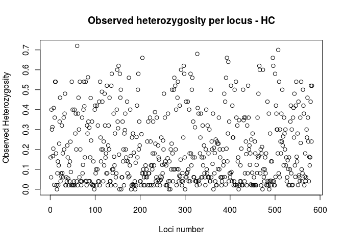

``` r
HC_basic$overall
```

    ##       Ho       Hs       Ht      Dst      Htp     Dstp      Fst 
    ## 0.200058 0.206433 0.206433 0.000000      NaN      NaN 0.000000 
    ##     Fstp      Fis     Dest 
    ##      NaN 0.030881      NaN

Does observed heterozygosity differ significantly from expected?

``` r
plot(HC_basic$Ho,HC_basic$Hs, xlab="Hobs", ylab="Hexp", 
     main="Expected heterozygosity as a function of observed heterozygosity per locus- HC")
```

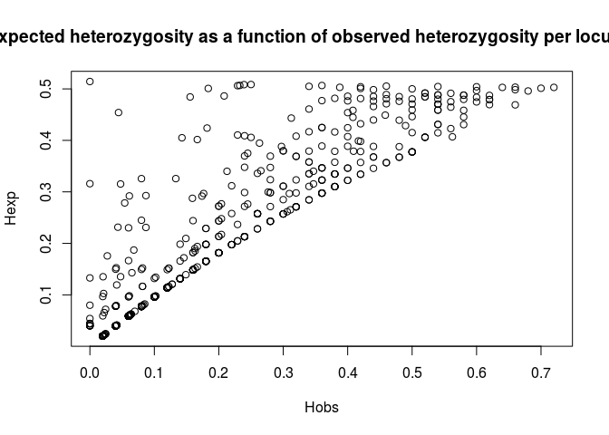

``` r
bartlett.test(list(HC_basic$Hs, HC_basic$Ho))
```

    ## 
    ##  Bartlett test of homogeneity of variances
    ## 
    ## data:  list(HC_basic$Hs, HC_basic$Ho)
    ## Bartlett's K-squared = 4.8745, df = 1, p-value = 0.02726

Yes, observed heterozygosity is generally lower than expected.

Oyster Bay population
---------------------

``` r
SS_basic <- basic.stats(SS$hierfstat.no.imputation)
plot(SS_basic$Ho[,1], xlab="Loci number", ylab="Observed Heterozygosity", 
     main="Observed heterozygosity per locus - SS")
```

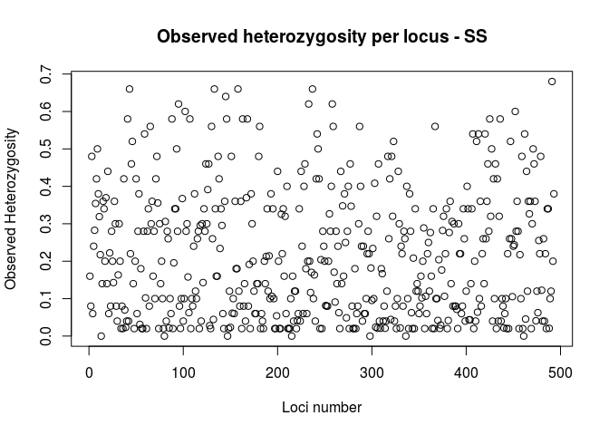

``` r
SS_basic$overall
```

    ##     Ho     Hs     Ht    Dst    Htp   Dstp    Fst   Fstp    Fis   Dest 
    ## 0.2151 0.2227 0.2227 0.0000    NaN    NaN 0.0000    NaN 0.0341    NaN

Does observed heterozygosity differ significantly from expected?

``` r
plot(SS_basic$Ho,SS_basic$Hs, xlab="Hobs", ylab="Hexp", 
     main="Expected heterozygosity as a function of observed heterozygosity per locus- SS")
```

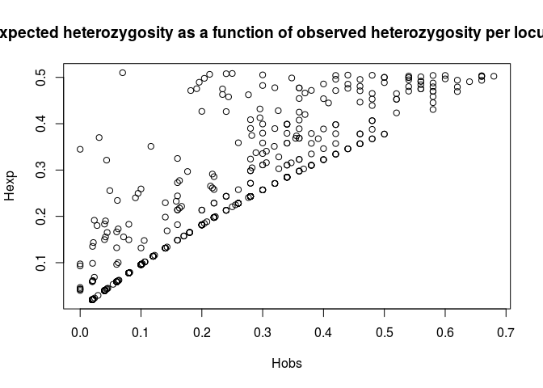

``` r
bartlett.test(list(SS_basic$Hs, SS_basic$Ho))
```

    ## 
    ##  Bartlett test of homogeneity of variances
    ## 
    ## data:  list(SS_basic$Hs, SS_basic$Ho)
    ## Bartlett's K-squared = 3.0093, df = 1, p-value = 0.08279

Fidalgo Bay population
----------------------

``` r
NF_basic <- basic.stats(NF$hierfstat.no.imputation)
plot(NF_basic$Ho[,1], xlab="Loci number", ylab="Observed Heterozygosity", 
     main="Observed heterozygosity per locus - NF")
```

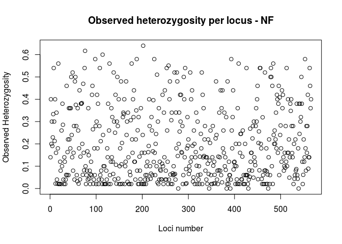

``` r
NF_basic$overall
```

    ##     Ho     Hs     Ht    Dst    Htp   Dstp    Fst   Fstp    Fis   Dest 
    ## 0.1957 0.2081 0.2081 0.0000    NaN    NaN 0.0000    NaN 0.0593    NaN

``` r
plot(NF_basic$Ho,NF_basic$Hs, xlab="Hobs", ylab="Hexp", 
     main="Expected heterozygosity as a function of observed heterozygosity per locus- NF")
```

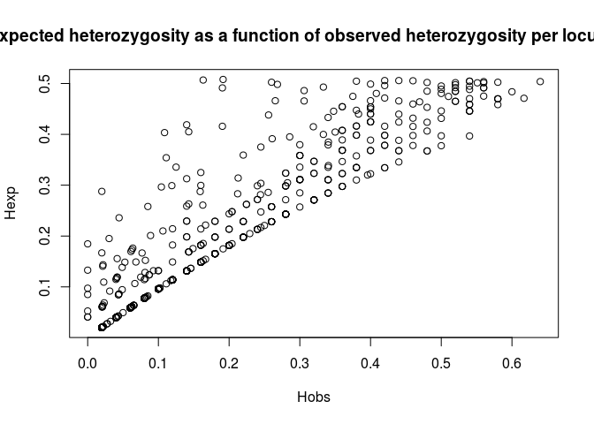

``` r
bartlett.test(list(NF_basic$Hs, NF_basic$Ho))
```

    ## 
    ##  Bartlett test of homogeneity of variances
    ## 
    ## data:  list(NF_basic$Hs, NF_basic$Ho)
    ## Bartlett's K-squared = 1.0518, df = 1, p-value = 0.3051

Relatedness
===========

Run relatedness2 function through VCFtools for each of the threee populations, using SNPs that are polymorphic in each population. Takes as input a VCF file and a list of the samples within each population.

``` r
system('vcftools --vcf ../../Data/o15final90-m75.recode.vcf --keep HC15.pop --mac 1 --relatedness2 --out HC-o15final90-mac1-m75')

system('vcftools --vcf ../../Data/o15final90-m75.recode.vcf --keep SS15.pop --mac 1 --relatedness2 --out SS-o15final90-mac1-m75')

system('vcftools --vcf ../../Data/o15final90-m75.recode.vcf --keep NF15.pop --mac 1 --relatedness2 --out NF-o15final90-mac1-m75')
```

Oyster Bay
----------

Read in output and filter out pairwise comparision with self and duplicate pairwise combinations.

``` r
relate2SS <- read.table(file = "SS-o15final90-mac1-m75.relatedness2",header = T)
relate2SS <- select(relate2SS,INDV1,INDV2,RELATEDNESS_PHI)
head(relate2SS)
```

    ##     INDV1       INDV2 RELATEDNESS_PHI
    ## 1 SS1-1.m     SS1-1.m       0.5000000
    ## 2 SS1-1.m    SS1-12.m       0.0300000
    ## 3 SS1-1.m    SS1-14.m       0.0000000
    ## 4 SS1-1.m SS1-17-L5.m      -0.0792079
    ## 5 SS1-1.m    SS1-19.m      -0.0141509
    ## 6 SS1-1.m     SS1-2.m      -0.0490196

``` r
#Remove comparisions with self
relate2SS.noself <- filter(relate2SS, INDV1 != INDV2)

#Remove duplicate comparisions
relate2SS.noreps <- relate2SS.noself[!duplicated(t(apply(relate2SS.noself,1,sort))),]

plot(relate2SS.noreps$INDV1, relate2SS.noreps$RELATEDNESS_PHI, xlab="INDV1", ylab="PHI values",main="All PHI values", las=2)
```

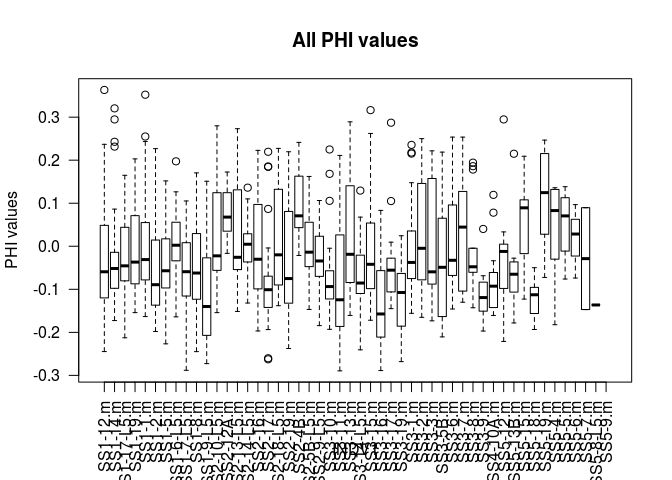

``` r
#Set all negative values to 0. Extreme negative values *can* indicate that the two individuals are from different populations, but these are all generally low frequency.
relate2SS.noreps <- mutate(relate2SS.noreps, trun_phi = ifelse(RELATEDNESS_PHI < 0, 0, RELATEDNESS_PHI))
head(relate2SS.noreps)
```

    ##     INDV1       INDV2 RELATEDNESS_PHI trun_phi
    ## 1 SS1-1.m    SS1-12.m       0.0300000     0.03
    ## 2 SS1-1.m    SS1-14.m       0.0000000     0.00
    ## 3 SS1-1.m SS1-17-L5.m      -0.0792079     0.00
    ## 4 SS1-1.m    SS1-19.m      -0.0141509     0.00
    ## 5 SS1-1.m     SS1-2.m      -0.0490196     0.00
    ## 6 SS1-1.m     SS1-5.m      -0.1200000     0.00

Get the number of pairwise comparisions that conservatively may be Full Sibs, based on Relationship inference criteria from Manichaikul et al. 2010 Bioinformatics.

``` r
##Mean relatedness
mean(relate2SS.noreps$trun_phi)
```

    ## [1] 0.03716295

``` r
##Number of Full Sib comparisions
sum(relate2SS.noreps$RELATEDNESS_PHI >= 0.18)
```

    ## [1] 87

``` r
##Proportion of full sib comparisions
sum(relate2SS.noreps$RELATEDNESS_PHI >= 0.18)/nrow(relate2SS.noreps)
```

    ## [1] 0.07102041

``` r
##Proportion related individuals
length(unique(relate2SS.noself[which(relate2SS.noself$RELATEDNESS_PHI>=0.18),1]))/length(unique(relate2SS.noself[,1]))
```

    ## [1] 0.82

``` r
plot(density(relate2SS.noreps$trun_phi))
```

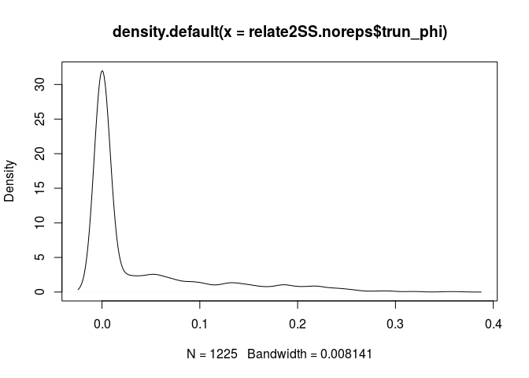

``` r
plot(relate2SS.noreps$INDV1, relate2SS.noreps$trun_phi, xlab="INDV1", ylab="Truncated PHI values",main="Truncated PHI values", las=2)
```

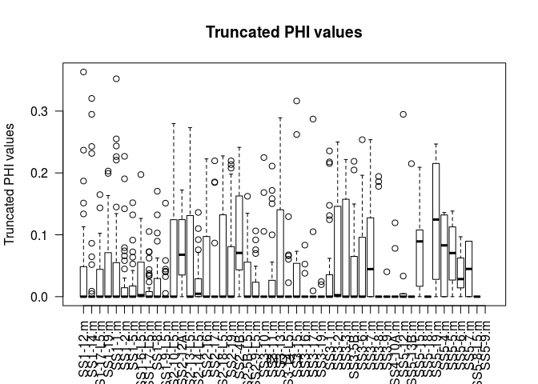

Dabob Bay
---------

``` r
##Mean relatedness
mean(relate2HC.noreps$trun_phi)
```

    ## [1] 0.04363781

``` r
##Number of Full Sib comparisions
sum(relate2HC.noreps$RELATEDNESS_PHI >= 0.18)
```

    ## [1] 81

``` r
##Proportion of full sib comparisions
sum(relate2HC.noreps$RELATEDNESS_PHI >= 0.18)/nrow(relate2HC.noreps)
```

    ## [1] 0.06612245

``` r
##Proportion related individuals
length(unique(relate2HC.noself[which(relate2HC.noself$RELATEDNESS_PHI>=0.18),1]))/length(unique(relate2HC.noself[,1]))
```

    ## [1] 0.76

``` r
plot(density(relate2HC.noreps$trun_phi))
```

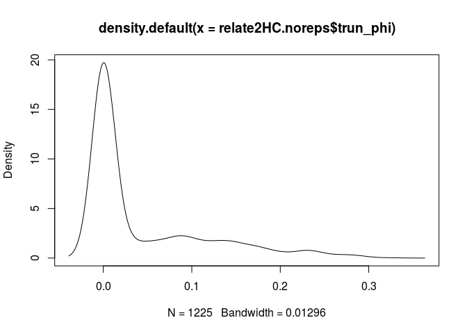

``` r
plot(relate2HC.noreps$INDV1, relate2HC.noreps$trun_phi, xlab="INDV1", ylab="Truncated PHI values",main="Truncated PHI values", las=2)
```

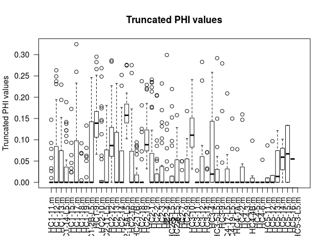

Fidalgo Bay
-----------

``` r
##Mean relatedness
mean(relate2NF.noreps$trun_phi)
```

    ## [1] 0.01914857

``` r
##Number of Full Sib comparisions
sum(relate2NF.noreps$RELATEDNESS_PHI >= 0.18)
```

    ## [1] 19

``` r
##Proportion of full sib comparisions
sum(relate2NF.noreps$RELATEDNESS_PHI >= 0.18)/nrow(relate2NF.noreps)
```

    ## [1] 0.0155102

``` r
##Proportion related individuals
length(unique(relate2NF.noself[which(relate2NF.noself$RELATEDNESS_PHI>=0.18),1]))/length(unique(relate2NF.noself[,1]))
```

    ## [1] 0.5

``` r
plot(density(relate2NF.noreps$trun_phi))
```

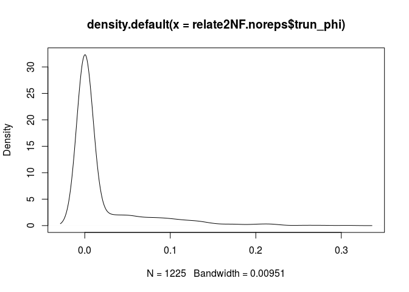

``` r
plot(relate2NF.noreps$INDV1, relate2NF.noreps$trun_phi, xlab="INDV1", ylab="Truncated PHI values",main="Truncated PHI values", las=2)
```

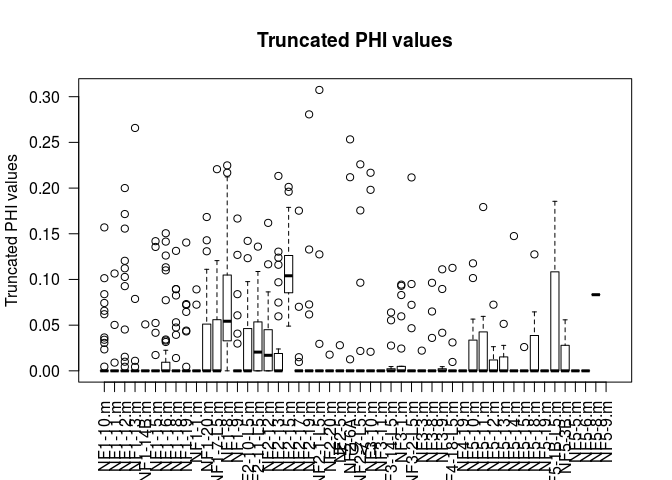 \#\# Together

``` r
plot(density(relate2SS.noreps$trun_phi), ylim = c(0,35), xlim= c(-0.05,0.4),main = "Distribution of F1 Kinship Estimates", xlab = "Relatedness", col = "#56B4E9")
lines(density(relate2HC.noreps$trun_phi), col = "#999999")
lines(density(relate2NF.noreps$trun_phi), col = "#E69F00")
legend("right",c("Oyster Bay","Dabob Bay","Fidalgo Bay"),fill = c("#56B4E9","#999999","#E69F00"))
```

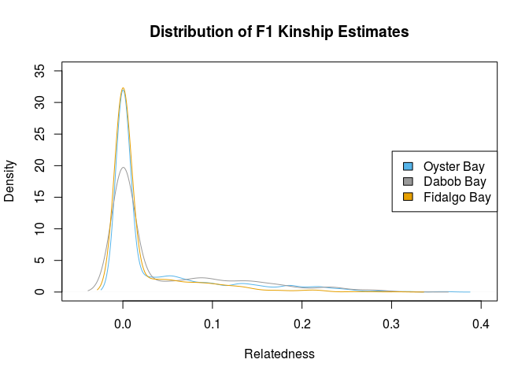
