Puget Sound Larvae Growth
================
Katherine Silliman

-   [Setting up](#setting-up)
-   [Length](#length)
    -   [Checking for normal distribution](#checking-for-normal-distribution)
    -   [Plotting Size through time](#plotting-size-through-time)
    -   [Testing for differences in size](#testing-for-differences-in-size)
        -   [Day 0](#day-0)
        -   [Day 7](#day-7)
        -   [Day 14](#day-14)
-   [Area](#area)
    -   [Checking for normal distribution](#checking-for-normal-distribution-1)
    -   [Plotting through time](#plotting-through-time)
    -   [Testing for differences in area](#testing-for-differences-in-area)
        -   [Day 1](#day-1)
        -   [Day 7](#day-7-1)
        -   [Day 14](#day-14-1)
-   [Using Relative Area and Length](#using-relative-area-and-length)

References <http://www.flutterbys.com.au/stats/tut/tut9.2a.html> <http://rcompanion.org/rcompanion/d_07.html>

``` r
library(dplyr) #data frame grouping
library(nlme) #LMMs, using likelihood ratio test for significance
library(plotrix)#for SE calculation
library(ggplot2)
library(lme4) #for linear mixed models
library(afex) #different way for getting significance from LMMs
library(PMCMR) #Kruskal-Wallis test
```

Setting up
==========

Reading in larvae size data.

``` r
all.larvae <- read.csv("../../Data/PS_Larvae.csv",header = TRUE, na.strings = "#DIV/0!")
G1.all <- select(all.larvae, Population, Replicate, Date, Average_Length,Area) %>% group_by(Population,Date)
```

Summarizing sizes at different time points.

``` r
G1.all.mean <- summarise(G1.all,mean.Area = mean(Area, na.rm = T),se.Area = std.error(Area,na.rm =T),mean.Length = mean(Average_Length, na.rm = T),se.Length = std.error(Average_Length,na.rm =T))
G1.all.mean
```

    ## # A tibble: 9 x 6
    ## # Groups:   Population [?]
    ##    Population    Date  mean.Area      se.Area mean.Length   se.Length
    ##        <fctr>  <fctr>      <dbl>        <dbl>       <dbl>       <dbl>
    ## 1   Dabob Bay  7-1-15 0.01577500 0.0003972205   0.1515917 0.002777356
    ## 2   Dabob Bay 7-15-15 0.02154857 0.0007357758   0.1743571 0.003323487
    ## 3   Dabob Bay  7-8-15 0.01841806 0.0004361045   0.1639500 0.002119499
    ## 4 Fidalgo Bay  7-1-15 0.01687000 0.0004714416   0.1558900 0.002610812
    ## 5 Fidalgo Bay 7-15-15 0.02482000 0.0008823439   0.1899412 0.003382312
    ## 6 Fidalgo Bay  7-8-15 0.02133889 0.0003065690   0.1769389 0.001332418
    ## 7  Oyster Bay  7-1-15 0.01671818 0.0003438600   0.1561818 0.002239970
    ## 8  Oyster Bay 7-15-15 0.02263588 0.0005660942   0.1801235 0.002482262
    ## 9  Oyster Bay  7-8-15 0.01971667 0.0003157443   0.1669556 0.001640085

``` r
G1.all.mean$Date <- c(0,14,7,0,14,7,0,14,7)
```

Length
======

Checking for normal distribution
--------------------------------

Checking for normal distributions in Length at each time point. 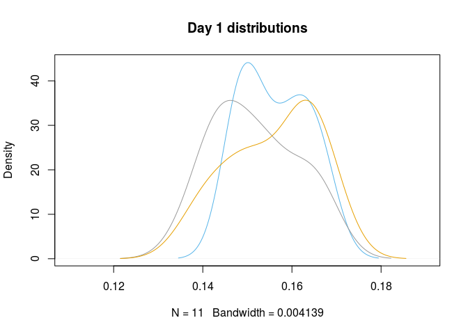

    ## 
    ##  Shapiro-Wilk normality test
    ## 
    ## data:  filter(G1.all, Date == "7-1-15", Population == "Oyster Bay")$Average_Length
    ## W = 0.91079, p-value = 0.2492

    ## 
    ##  Shapiro-Wilk normality test
    ## 
    ## data:  filter(G1.all, Date == "7-1-15", Population == "Dabob Bay")$Average_Length
    ## W = 0.93895, p-value = 0.4846

    ## 
    ##  Shapiro-Wilk normality test
    ## 
    ## data:  filter(G1.all, Date == "7-1-15", Population == "Fidalgo Bay")$Average_Length
    ## W = 0.93867, p-value = 0.3659

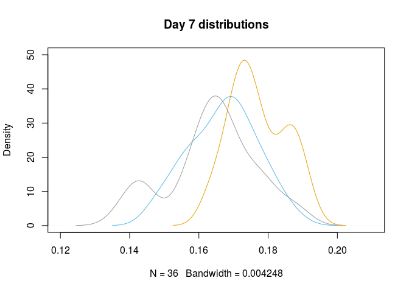

    ## 
    ##  Shapiro-Wilk normality test
    ## 
    ## data:  filter(G1.all, Date == "7-8-15", Population == "Oyster Bay")$Average_Length
    ## W = 0.98458, p-value = 0.8858

    ## 
    ##  Shapiro-Wilk normality test
    ## 
    ## data:  filter(G1.all, Date == "7-8-15", Population == "Dabob Bay")$Average_Length
    ## W = 0.96174, p-value = 0.2431

    ## 
    ##  Shapiro-Wilk normality test
    ## 
    ## data:  filter(G1.all, Date == "7-8-15", Population == "Fidalgo Bay")$Average_Length
    ## W = 0.9524, p-value = 0.1245

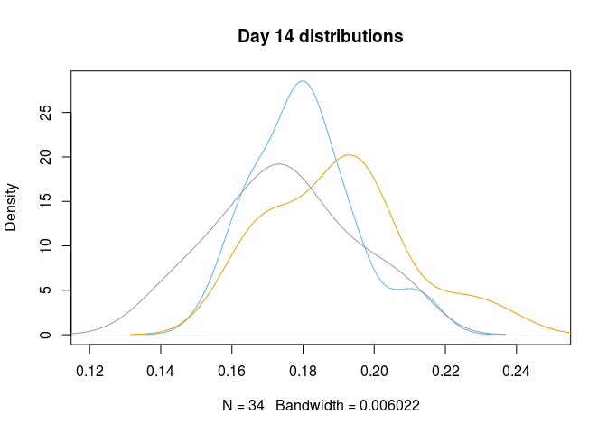

    ## 
    ##  Shapiro-Wilk normality test
    ## 
    ## data:  filter(G1.all, Date == "7-15-15", Population == "Oyster Bay")$Average_Length
    ## W = 0.96982, p-value = 0.4564

    ## 
    ##  Shapiro-Wilk normality test
    ## 
    ## data:  filter(G1.all, Date == "7-15-15", Population == "Dabob Bay")$Average_Length
    ## W = 0.98128, p-value = 0.7999

    ## 
    ##  Shapiro-Wilk normality test
    ## 
    ## data:  filter(G1.all, Date == "7-15-15", Population == "Fidalgo Bay")$Average_Length
    ## W = 0.96115, p-value = 0.2626

Plotting Size through time
--------------------------

``` r
Fig.L <- ggplot(G1.all.mean, aes(x=Date, y=mean.Length, group=Population)) +
  geom_errorbar(aes(ymin=G1.all.mean$mean.Length-G1.all.mean$se.Length,ymax=G1.all.mean$mean.Length+G1.all.mean$se.Length,color=Population), width=.07) +
  geom_line(aes(color=Population) ,size = 0.5) +   
  geom_point(aes(shape=Population,color=Population), size = 3)+
  xlab("Days") +scale_x_continuous(breaks=c(1,7,14))+
  ylab(expression(paste("Shell Area (mm)"))) +
  theme_bw() + #Set the background color
  theme(axis.text.x = element_text(vjust = 1, hjust=1, size = 12), #Set the text angle
        axis.line = element_line(color = 'black'), #Set the axes color
        panel.border = element_blank(), #Set the border
        panel.grid.major = element_blank(), #Set the major gridlines
        panel.grid.minor = element_blank(), #Set the minor gridlines
        plot.background=element_blank(),  #Set the plot background
        legend.key = element_blank(),  #remove legend background
        legend.position=c(.2, .7)) + #set legend location
  ggtitle("Larvae Shell Length") +
  theme(plot.title = element_text(face = 'bold', 
                                  size = 14, 
                                  hjust = 0))
Fig.L <- Fig.L + scale_color_manual(values=c("#999999", "#E69F00", "#56B4E9"))
Fig.L
```

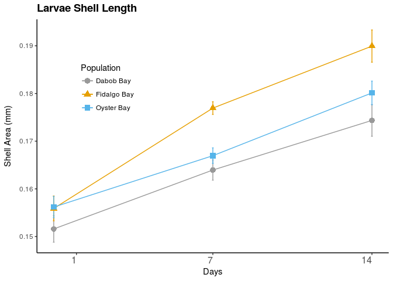

Testing for differences in size
-------------------------------

### Day 0

Plotting size distributions at Day 0.

``` r
p.Day1.L <- ggplot(filter(G1.all,Date == "7-1-15"), aes(x=Population, y=Average_Length,fill=Population)) + 
  geom_violin(trim=FALSE) + scale_fill_manual(values=c("#999999", "#E69F00", "#56B4E9")) + geom_boxplot(width=0.1,fill="white") + labs(title="Length Day 0",y="Length (mm)")
p.Day1.L
```

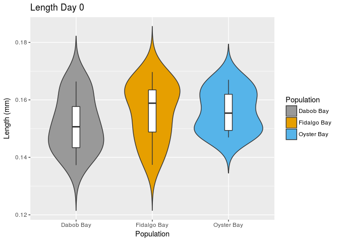 ANOVA of size at Day 1 to test if size differs accross populations at Day 1

``` r
G1.D1 <- filter(G1.all, Date == "7-1-15")
area.D1 <- aov(Area ~ Population, data=G1.D1) #test the hypothesis relative size does not differ between treatments on Day 1
summary(area.D1)
```

    ##             Df    Sum Sq   Mean Sq F value Pr(>F)
    ## Population   2 8.870e-06 4.435e-06   1.928  0.161
    ## Residuals   35 8.051e-05 2.300e-06

``` r
length.D1 <- aov(Average_Length ~ Population, data=G1.D1) #test the hypothesis relative size does not differ between treatments on Day 1
summary(length.D1)
```

    ##             Df    Sum Sq   Mean Sq F value Pr(>F)
    ## Population   2 0.0001611 8.054e-05   0.939  0.401
    ## Residuals   35 0.0030016 8.576e-05

``` r
pairwise.t.test(G1.D1$Average_Length,G1.D1$Population,p.adjust.method = "bonferroni")
```

    ## 
    ##  Pairwise comparisons using t tests with pooled SD 
    ## 
    ## data:  G1.D1$Average_Length and G1.D1$Population 
    ## 
    ##             Dabob Bay Fidalgo Bay
    ## Fidalgo Bay 0.72      -          
    ## Oyster Bay  0.73      1.00       
    ## 
    ## P value adjustment method: bonferroni

``` r
t.test(filter(G1.D1,Population == "Dabob Bay")$Average_Length,filter(G1.D1,Population == "Fidalgo Bay")$Average_Length)
```

    ## 
    ##  Welch Two Sample t-test
    ## 
    ## data:  filter(G1.D1, Population == "Dabob Bay")$Average_Length and filter(G1.D1, Population == "Fidalgo Bay")$Average_Length
    ## t = -1.1276, df = 24.189, p-value = 0.2705
    ## alternative hypothesis: true difference in means is not equal to 0
    ## 95 percent confidence interval:
    ##  -0.012162308  0.003565641
    ## sample estimates:
    ## mean of x mean of y 
    ## 0.1515917 0.1558900

``` r
area.D1 <- aov(Average_Length ~ Population, data=G1.D1) 
summary(area.D1)
```

    ##             Df    Sum Sq   Mean Sq F value Pr(>F)
    ## Population   2 0.0001611 8.054e-05   0.939  0.401
    ## Residuals   35 0.0030016 8.576e-05

``` r
TukeyHSD(area.D1)
```

    ##   Tukey multiple comparisons of means
    ##     95% family-wise confidence level
    ## 
    ## Fit: aov(formula = Average_Length ~ Population, data = G1.D1)
    ## 
    ## $Population
    ##                                diff          lwr         upr     p adj
    ## Fidalgo Bay-Dabob Bay  0.0042983333 -0.004479111 0.013075778 0.4620086
    ## Oyster Bay-Dabob Bay   0.0045901515 -0.004870029 0.014050332 0.4684141
    ## Oyster Bay-Fidalgo Bay 0.0002918182 -0.008704549 0.009288185 0.9965321

### Day 7

Untransformed shell length, Day 7.

``` r
G1.D7 <- filter(G1.all, Date == "7-8-15")
length.D7.model = lmer(Average_Length ~ Population + (1|Replicate),data=G1.D7,na.action = na.omit)
summary(length.D7.model)
```

    ## Linear mixed model fit by REML t-tests use Satterthwaite approximations
    ##   to degrees of freedom [lmerMod]
    ## Formula: Average_Length ~ Population + (1 | Replicate)
    ##    Data: G1.D7
    ## 
    ## REML criterion at convergence: -650.8
    ## 
    ## Scaled residuals: 
    ##      Min       1Q   Median       3Q      Max 
    ## -2.52225 -0.56921  0.01018  0.70156  2.32934 
    ## 
    ## Random effects:
    ##  Groups    Name        Variance  Std.Dev.
    ##  Replicate (Intercept) 0.0000000 0.00000 
    ##  Residual              0.0001075 0.01037 
    ## Number of obs: 108, groups:  Replicate, 9
    ## 
    ## Fixed effects:
    ##                        Estimate Std. Error        df t value Pr(>|t|)    
    ## (Intercept)           1.640e-01  1.728e-03 1.050e+02  94.881  < 2e-16 ***
    ## PopulationFidalgo Bay 1.299e-02  2.444e-03 1.050e+02   5.315 6.03e-07 ***
    ## PopulationOyster Bay  3.006e-03  2.444e-03 1.050e+02   1.230    0.221    
    ## ---
    ## Signif. codes:  0 '***' 0.001 '**' 0.01 '*' 0.05 '.' 0.1 ' ' 1
    ## 
    ## Correlation of Fixed Effects:
    ##             (Intr) PpltFB
    ## PpltnFdlgBy -0.707       
    ## PpltnOystrB -0.707  0.500

``` r
area.null <- lmer(Average_Length ~ (1|Replicate),data=G1.D7,REML=FALSE)
area.model.R <- lmer(Average_Length ~ Population + (1|Replicate),data=G1.D7,REML = F)
anova(area.null,area.model.R)
```

    ## Data: G1.D7
    ## Models:
    ## area.null: Average_Length ~ (1 | Replicate)
    ## area.model.R: Average_Length ~ Population + (1 | Replicate)
    ##              Df     AIC     BIC logLik deviance  Chisq Chi Df Pr(>Chisq)
    ## area.null     3 -658.59 -650.54 332.29  -664.59                         
    ## area.model.R  5 -673.47 -660.06 341.73  -683.47 18.882      2  7.939e-05
    ##                 
    ## area.null       
    ## area.model.R ***
    ## ---
    ## Signif. codes:  0 '***' 0.001 '**' 0.01 '*' 0.05 '.' 0.1 ' ' 1

``` r
afex.1 <- mixed(Average_Length ~ Population + (1|Replicate), data=G1.D7,na.action = na.omit)
```

    ## Fitting one lmer() model. [DONE]
    ## Calculating p-values. [DONE]

``` r
print(afex.1)
```

    ## Mixed Model Anova Table (Type 3 tests, KR-method)
    ## 
    ## Model: Average_Length ~ Population + (1 | Replicate)
    ## Data: G1.D7
    ##       Effect   df        F p.value
    ## 1 Population 2, 6 15.48 **    .004
    ## ---
    ## Signif. codes:  0 '***' 0.001 '**' 0.01 '*' 0.05 '+' 0.1 ' ' 1

``` r
pairwise.t.test(G1.D7$Average_Length,G1.D7$Population,p.adjust.method = "bonferroni")
```

    ## 
    ##  Pairwise comparisons using t tests with pooled SD 
    ## 
    ## data:  G1.D7$Average_Length and G1.D7$Population 
    ## 
    ##             Dabob Bay Fidalgo Bay
    ## Fidalgo Bay 1.8e-06   -          
    ## Oyster Bay  0.66443   0.00026    
    ## 
    ## P value adjustment method: bonferroni

``` r
area.D1 <- aov(Average_Length ~ Population, data=G1.D7) 
summary(area.D1)
```

    ##              Df   Sum Sq   Mean Sq F value   Pr(>F)    
    ## Population    2 0.003329 0.0016645   15.48 1.28e-06 ***
    ## Residuals   105 0.011286 0.0001075                     
    ## ---
    ## Signif. codes:  0 '***' 0.001 '**' 0.01 '*' 0.05 '.' 0.1 ' ' 1

``` r
TukeyHSD(area.D1)
```

    ##   Tukey multiple comparisons of means
    ##     95% family-wise confidence level
    ## 
    ## Fit: aov(formula = Average_Length ~ Population, data = G1.D7)
    ## 
    ## $Population
    ##                                diff          lwr          upr     p adj
    ## Fidalgo Bay-Dabob Bay   0.012988889  0.007179226  0.018798551 0.0000018
    ## Oyster Bay-Dabob Bay    0.003005556 -0.002804107  0.008815218 0.4382959
    ## Oyster Bay-Fidalgo Bay -0.009983333 -0.015792996 -0.004173671 0.0002527

### Day 14

Day 14 untransformed shell length:

``` r
G1.D14 <- filter(G1.all, Date == "7-15-15")
relarea.D14.model = lmer(Average_Length ~ Population + (1|Replicate), data=G1.D14,na.action = na.omit)
summary(relarea.D14.model)
```

    ## Linear mixed model fit by REML t-tests use Satterthwaite approximations
    ##   to degrees of freedom [lmerMod]
    ## Formula: Average_Length ~ Population + (1 | Replicate)
    ##    Data: G1.D14
    ## 
    ## REML criterion at convergence: -509.3
    ## 
    ## Scaled residuals: 
    ##      Min       1Q   Median       3Q      Max 
    ## -2.13320 -0.66970 -0.02663  0.54108  2.69434 
    ## 
    ## Random effects:
    ##  Groups    Name        Variance  Std.Dev.
    ##  Replicate (Intercept) 0.0000279 0.005282
    ##  Residual              0.0003099 0.017604
    ## Number of obs: 103, groups:  Replicate, 9
    ## 
    ## Fixed effects:
    ##                       Estimate Std. Error       df t value Pr(>|t|)    
    ## (Intercept)           0.174493   0.004262 5.824000  40.944 2.17e-08 ***
    ## PopulationFidalgo Bay 0.015429   0.006051 5.908000   2.550   0.0441 *  
    ## PopulationOyster Bay  0.005861   0.006051 5.908000   0.969   0.3707    
    ## ---
    ## Signif. codes:  0 '***' 0.001 '**' 0.01 '*' 0.05 '.' 0.1 ' ' 1
    ## 
    ## Correlation of Fixed Effects:
    ##             (Intr) PpltFB
    ## PpltnFdlgBy -0.704       
    ## PpltnOystrB -0.704  0.496

``` r
relarea.null <- lmer(Average_Length ~ (1|Replicate),data=G1.D14,REML=FALSE)
relarea.model.R <- lmer(Average_Length ~ Population + (1|Replicate), data=G1.D14,REML = FALSE)
anova(relarea.null,relarea.model.R)
```

    ## Data: G1.D14
    ## Models:
    ## relarea.null: Average_Length ~ (1 | Replicate)
    ## relarea.model.R: Average_Length ~ Population + (1 | Replicate)
    ##                 Df     AIC     BIC logLik deviance  Chisq Chi Df
    ## relarea.null     3 -524.49 -516.58 265.24  -530.49              
    ## relarea.model.R  5 -527.15 -513.98 268.58  -537.15 6.6637      2
    ##                 Pr(>Chisq)  
    ## relarea.null                
    ## relarea.model.R    0.03573 *
    ## ---
    ## Signif. codes:  0 '***' 0.001 '**' 0.01 '*' 0.05 '.' 0.1 ' ' 1

``` r
afex.1 <- mixed(Average_Length~ Population + (1|Replicate), data=G1.D14,na.action = na.omit)
```

    ## Fitting one lmer() model. [DONE]
    ## Calculating p-values. [DONE]

``` r
print(afex.1)
```

    ## Mixed Model Anova Table (Type 3 tests, KR-method)
    ## 
    ## Model: Average_Length ~ Population + (1 | Replicate)
    ## Data: G1.D14
    ##       Effect      df    F p.value
    ## 1 Population 2, 5.98 3.31     .11
    ## ---
    ## Signif. codes:  0 '***' 0.001 '**' 0.01 '*' 0.05 '+' 0.1 ' ' 1

``` r
pairwise.t.test(G1.D14$Average_Length,G1.D14$Population,p.adjust.method = "bonferroni")
```

    ## 
    ##  Pairwise comparisons using t tests with pooled SD 
    ## 
    ## data:  G1.D14$Average_Length and G1.D14$Population 
    ## 
    ##             Dabob Bay Fidalgo Bay
    ## Fidalgo Bay 0.0017    -          
    ## Oyster Bay  0.5692    0.0836     
    ## 
    ## P value adjustment method: bonferroni

``` r
area.D1 <- aov(Average_Length ~ Population, data=G1.D14) 
summary(area.D1)
```

    ##              Df  Sum Sq   Mean Sq F value  Pr(>F)   
    ## Population    2 0.00427 0.0021359   6.493 0.00223 **
    ## Residuals   100 0.03289 0.0003289                   
    ## ---
    ## Signif. codes:  0 '***' 0.001 '**' 0.01 '*' 0.05 '.' 0.1 ' ' 1

``` r
TukeyHSD(area.D1)
```

    ##   Tukey multiple comparisons of means
    ##     95% family-wise confidence level
    ## 
    ## Fit: aov(formula = Average_Length ~ Population, data = G1.D14)
    ## 
    ## $Population
    ##                                diff          lwr          upr     p adj
    ## Fidalgo Bay-Dabob Bay   0.015584034  0.005193938 0.0259741296 0.0015920
    ## Oyster Bay-Dabob Bay    0.005766387 -0.004623709 0.0161564826 0.3872569
    ## Oyster Bay-Fidalgo Bay -0.009817647 -0.020282763 0.0006474687 0.0707369

Area
====

Checking for normal distribution
--------------------------------

Checking for normal distributions in Area at each time point.

``` r
plot(density(filter(G1.all,Date=="7-1-15",Population=="Oyster Bay")$Area,na.rm = T),col="#56B4E9", main ="Day 1 distributions")
lines(density(filter(G1.all,Date=="7-1-15",Population=="Dabob Bay")$Area,na.rm = T),col="#999999")
lines(density(filter(G1.all,Date=="7-1-15",Population=="Fidalgo Bay")$Area,na.rm = T),col="#E69F00")
```

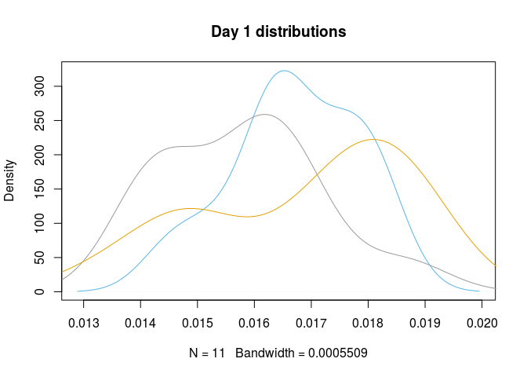

``` r
shapiro.test(filter(G1.all,Date=="7-1-15",Population=="Oyster Bay")$Area)
```

    ## 
    ##  Shapiro-Wilk normality test
    ## 
    ## data:  filter(G1.all, Date == "7-1-15", Population == "Oyster Bay")$Area
    ## W = 0.95907, p-value = 0.76

``` r
shapiro.test(filter(G1.all,Date=="7-1-15",Population=="Dabob Bay")$Area)
```

    ## 
    ##  Shapiro-Wilk normality test
    ## 
    ## data:  filter(G1.all, Date == "7-1-15", Population == "Dabob Bay")$Area
    ## W = 0.92883, p-value = 0.3679

``` r
shapiro.test(filter(G1.all,Date=="7-1-15",Population=="Fidalgo Bay")$Area)
```

    ## 
    ##  Shapiro-Wilk normality test
    ## 
    ## data:  filter(G1.all, Date == "7-1-15", Population == "Fidalgo Bay")$Area
    ## W = 0.88912, p-value = 0.06504

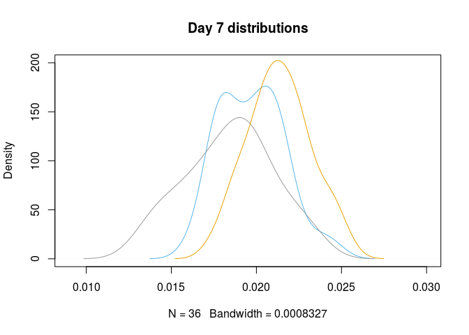

    ## 
    ##  Shapiro-Wilk normality test
    ## 
    ## data:  filter(G1.all, Date == "7-8-15", Population == "Oyster Bay")$Area
    ## W = 0.9715, p-value = 0.4678

    ## 
    ##  Shapiro-Wilk normality test
    ## 
    ## data:  filter(G1.all, Date == "7-8-15", Population == "Dabob Bay")$Area
    ## W = 0.98315, p-value = 0.8458

    ## 
    ##  Shapiro-Wilk normality test
    ## 
    ## data:  filter(G1.all, Date == "7-8-15", Population == "Fidalgo Bay")$Area
    ## W = 0.98996, p-value = 0.9822

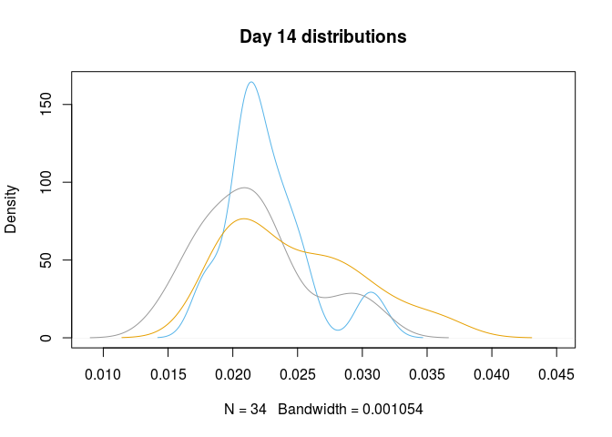

    ## 
    ##  Shapiro-Wilk normality test
    ## 
    ## data:  filter(G1.all, Date == "7-15-15", Population == "Oyster Bay")$Area
    ## W = 0.90547, p-value = 0.006419

    ## 
    ##  Shapiro-Wilk normality test
    ## 
    ## data:  filter(G1.all, Date == "7-15-15", Population == "Dabob Bay")$Area
    ## W = 0.952, p-value = 0.1306

    ## 
    ##  Shapiro-Wilk normality test
    ## 
    ## data:  filter(G1.all, Date == "7-15-15", Population == "Fidalgo Bay")$Area
    ## W = 0.92243, p-value = 0.01893

Plotting through time
---------------------

``` r
Fig.Area <- ggplot(G1.all.mean, aes(x=Date, y=mean.Area, group=Population)) +
  geom_errorbar(aes(ymin=G1.all.mean$mean.Area-G1.all.mean$se.Area,ymax=G1.all.mean$mean.Area+G1.all.mean$se.Area,color=Population), width=.07) +
  geom_line(aes(color=Population) ,size = 0.5) +   
  geom_point(aes(shape=Population,color=Population), size = 3)+
  xlab("Days") +scale_x_continuous(breaks=c(1,7,14))+
  ylab(expression(paste("Shell Area (mm^2)"))) +
  theme_bw() + #Set the background color
  theme(axis.text.x = element_text(vjust = 1, hjust=1, size = 12), #Set the text angle
        axis.line = element_line(color = 'black'), #Set the axes color
        panel.border = element_blank(), #Set the border
        panel.grid.major = element_blank(), #Set the major gridlines
        panel.grid.minor = element_blank(), #Set the minor gridlines
        plot.background=element_blank(),  #Set the plot background
        legend.key = element_blank(),  #remove legend background
        legend.position=c(.2, .7)) + #set legend location
  ggtitle("Larvae Shell Area") +
  theme(plot.title = element_text(face = 'bold', 
                                  size = 14, 
                                  hjust = 0))
Fig.Area <- Fig.Area + scale_color_manual(values=c("#999999", "#E69F00", "#56B4E9"))
Fig.Area
```

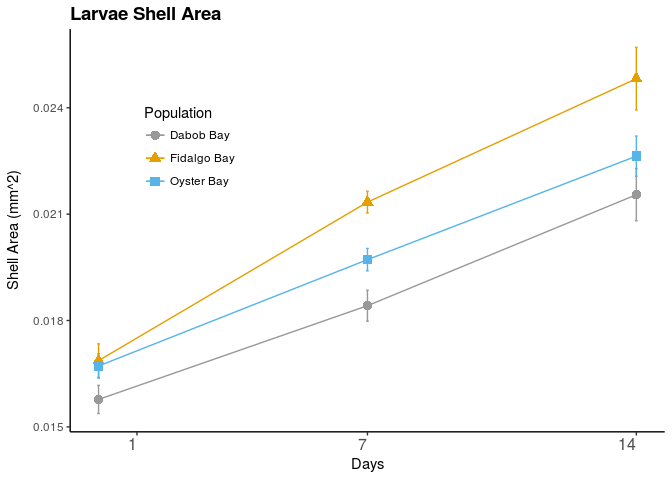

Testing for differences in area
-------------------------------

### Day 1

``` r
p.Day1 <- ggplot(filter(G1.all,Date == "7-1-15"), aes(x=Population, y=Area,fill=Population)) + 
  geom_violin(trim=FALSE) + scale_fill_manual(values=c("#999999", "#E69F00", "#56B4E9")) + geom_boxplot(width=0.1,fill="white") + labs(title="Area Day 1",y="Area (mm^2)")
p.Day1
```

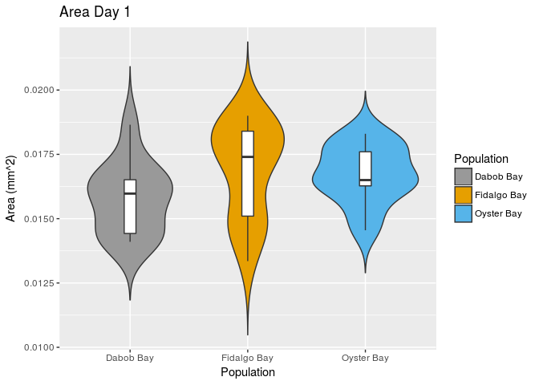

``` r
posthoc.kruskal.nemenyi.test(G1.D1$Area,as.factor(G1.D1$Population),dist="Chisquare")
```

    ## Warning in posthoc.kruskal.nemenyi.test.default(G1.D1$Area,
    ## as.factor(G1.D1$Population), : Ties are present. Chi-sq was corrected for
    ## ties.

    ## 
    ##  Pairwise comparisons using Nemenyi-test with Chi-squared    
    ##                        approximation for independent samples 
    ## 
    ## data:  G1.D1$Area and as.factor(G1.D1$Population) 
    ## 
    ##             Dabob Bay Fidalgo Bay
    ## Fidalgo Bay 0.11      -          
    ## Oyster Bay  0.30      0.91       
    ## 
    ## P value adjustment method: none

``` r
pairwise.t.test(G1.D1$Area,G1.D1$Population,p.adjust.method = "bonferroni")
```

    ## 
    ##  Pairwise comparisons using t tests with pooled SD 
    ## 
    ## data:  G1.D1$Area and G1.D1$Population 
    ## 
    ##             Dabob Bay Fidalgo Bay
    ## Fidalgo Bay 0.21      -          
    ## Oyster Bay  0.44      1.00       
    ## 
    ## P value adjustment method: bonferroni

### Day 7

Untransformed shell area.

``` r
area.D7.model = lmer(Area ~ Population + (1|Replicate),data=G1.D7,na.action = na.omit)
summary(area.D7.model)
```

    ## Linear mixed model fit by REML t-tests use Satterthwaite approximations
    ##   to degrees of freedom [lmerMod]
    ## Formula: Area ~ Population + (1 | Replicate)
    ##    Data: G1.D7
    ## 
    ## REML criterion at convergence: -981.5
    ## 
    ## Scaled residuals: 
    ##      Min       1Q   Median       3Q      Max 
    ## -2.40795 -0.71264 -0.00129  0.63661  2.36782 
    ## 
    ## Random effects:
    ##  Groups    Name        Variance  Std.Dev.
    ##  Replicate (Intercept) 0.000e+00 0.000000
    ##  Residual              4.606e-06 0.002146
    ## Number of obs: 108, groups:  Replicate, 9
    ## 
    ## Fixed effects:
    ##                        Estimate Std. Error        df t value Pr(>|t|)    
    ## (Intercept)           1.842e-02  3.577e-04 1.055e+02  51.489  < 2e-16 ***
    ## PopulationFidalgo Bay 2.921e-03  5.059e-04 1.055e+02   5.774 7.88e-08 ***
    ## PopulationOyster Bay  1.299e-03  5.059e-04 1.055e+02   2.567   0.0117 *  
    ## ---
    ## Signif. codes:  0 '***' 0.001 '**' 0.01 '*' 0.05 '.' 0.1 ' ' 1
    ## 
    ## Correlation of Fixed Effects:
    ##             (Intr) PpltFB
    ## PpltnFdlgBy -0.707       
    ## PpltnOystrB -0.707  0.500

``` r
area.null <- lmer(Area ~ (1|Replicate),data=G1.D7,REML=FALSE)
area.model.R <- lmer(Area ~ Population + (1|Replicate),data=G1.D7,REML = F)
anova(area.null,area.model.R)
```

    ## Data: G1.D7
    ## Models:
    ## area.null: Area ~ (1 | Replicate)
    ## area.model.R: Area ~ Population + (1 | Replicate)
    ##              Df      AIC      BIC logLik deviance  Chisq Chi Df Pr(>Chisq)
    ## area.null     3  -999.11  -991.06 502.55  -1005.1                         
    ## area.model.R  5 -1013.66 -1000.25 511.83  -1023.7 18.554      2  9.353e-05
    ##                 
    ## area.null       
    ## area.model.R ***
    ## ---
    ## Signif. codes:  0 '***' 0.001 '**' 0.01 '*' 0.05 '.' 0.1 ' ' 1

``` r
afex.1 <- mixed(Area ~ Population + (1|Replicate), data=G1.D7,na.action = na.omit)
```

    ## Fitting one lmer() model. [DONE]
    ## Calculating p-values. [DONE]

``` r
print(afex.1)
```

    ## Mixed Model Anova Table (Type 3 tests, KR-method)
    ## 
    ## Model: Area ~ Population + (1 | Replicate)
    ## Data: G1.D7
    ##       Effect   df        F p.value
    ## 1 Population 2, 6 16.74 **    .004
    ## ---
    ## Signif. codes:  0 '***' 0.001 '**' 0.01 '*' 0.05 '+' 0.1 ' ' 1

Log-transformed shell area.

``` r
Larea.D7.model = lmer(log10(Area) ~ Population + (1|Replicate),data=G1.D7,na.action = na.omit)
summary(Larea.D7.model)
```

    ## Linear mixed model fit by REML t-tests use Satterthwaite approximations
    ##   to degrees of freedom [lmerMod]
    ## Formula: log10(Area) ~ Population + (1 | Replicate)
    ##    Data: G1.D7
    ## 
    ## REML criterion at convergence: -325.6
    ## 
    ## Scaled residuals: 
    ##      Min       1Q   Median       3Q      Max 
    ## -2.84173 -0.66073  0.05593  0.68526  2.25970 
    ## 
    ## Random effects:
    ##  Groups    Name        Variance Std.Dev.
    ##  Replicate (Intercept) 0.00000  0.00000 
    ##  Residual              0.00238  0.04878 
    ## Number of obs: 108, groups:  Replicate, 9
    ## 
    ## Fixed effects:
    ##                        Estimate Std. Error        df  t value Pr(>|t|)    
    ## (Intercept)            -1.73916    0.00813 105.00000 -213.916  < 2e-16 ***
    ## PopulationFidalgo Bay   0.06676    0.01150 105.00000    5.806 6.87e-08 ***
    ## PopulationOyster Bay    0.03207    0.01150 105.00000    2.789  0.00627 ** 
    ## ---
    ## Signif. codes:  0 '***' 0.001 '**' 0.01 '*' 0.05 '.' 0.1 ' ' 1
    ## 
    ## Correlation of Fixed Effects:
    ##             (Intr) PpltFB
    ## PpltnFdlgBy -0.707       
    ## PpltnOystrB -0.707  0.500

``` r
area.null <- lmer(log10(Area) ~ (1|Replicate),data=G1.D7,REML=FALSE)
area.model.R <- lmer(log10(Area) ~ Population + (1|Replicate),data=G1.D7,REML = F)
anova(area.null,area.model.R)
```

    ## Data: G1.D7
    ## Models:
    ## area.null: log10(Area) ~ (1 | Replicate)
    ## area.model.R: log10(Area) ~ Population + (1 | Replicate)
    ##              Df     AIC     BIC logLik deviance  Chisq Chi Df Pr(>Chisq)
    ## area.null     3 -324.08 -316.04 165.04  -330.08                         
    ## area.model.R  5 -338.96 -325.55 174.48  -348.96 18.878      2  7.954e-05
    ##                 
    ## area.null       
    ## area.model.R ***
    ## ---
    ## Signif. codes:  0 '***' 0.001 '**' 0.01 '*' 0.05 '.' 0.1 ' ' 1

``` r
afex.1 <- mixed(log10(Area) ~ Population + (1|Replicate), data=G1.D7,na.action = na.omit)
```

    ## Fitting one lmer() model. [DONE]
    ## Calculating p-values. [DONE]

``` r
print(afex.1)
```

    ## Mixed Model Anova Table (Type 3 tests, KR-method)
    ## 
    ## Model: log10(Area) ~ Population + (1 | Replicate)
    ## Data: G1.D7
    ##       Effect   df        F p.value
    ## 1 Population 2, 6 16.86 **    .003
    ## ---
    ## Signif. codes:  0 '***' 0.001 '**' 0.01 '*' 0.05 '+' 0.1 ' ' 1

``` r
posthoc.kruskal.nemenyi.test(G1.D7$Area,as.factor(G1.D7$Population),dist="Chisquare")
```

    ## Warning in posthoc.kruskal.nemenyi.test.default(G1.D7$Area,
    ## as.factor(G1.D7$Population), : Ties are present. Chi-sq was corrected for
    ## ties.

    ## 
    ##  Pairwise comparisons using Nemenyi-test with Chi-squared    
    ##                        approximation for independent samples 
    ## 
    ## data:  G1.D7$Area and as.factor(G1.D7$Population) 
    ## 
    ##             Dabob Bay Fidalgo Bay
    ## Fidalgo Bay 5.4e-06   -          
    ## Oyster Bay  0.1990    0.0075     
    ## 
    ## P value adjustment method: none

``` r
pairwise.t.test(G1.D7$Area,G1.D7$Population,p.adjust.method = "bonferroni")
```

    ## 
    ##  Pairwise comparisons using t tests with pooled SD 
    ## 
    ## data:  G1.D7$Area and G1.D7$Population 
    ## 
    ##             Dabob Bay Fidalgo Bay
    ## Fidalgo Bay 2.4e-07   -          
    ## Oyster Bay  0.0350    0.0053     
    ## 
    ## P value adjustment method: bonferroni

``` r
#Showing anova gives same result
area.D7 <- aov(Area ~ Population, data=G1.D7) #test the hypothesis relative size does not differ between treatments on Day 1
summary(area.D7)
```

    ##              Df    Sum Sq  Mean Sq F value   Pr(>F)    
    ## Population    2 0.0001542 7.71e-05   16.74 4.91e-07 ***
    ## Residuals   105 0.0004837 4.61e-06                     
    ## ---
    ## Signif. codes:  0 '***' 0.001 '**' 0.01 '*' 0.05 '.' 0.1 ' ' 1

``` r
TukeyHSD(area.D7)
```

    ##   Tukey multiple comparisons of means
    ##     95% family-wise confidence level
    ## 
    ## Fit: aov(formula = Area ~ Population, data = G1.D7)
    ## 
    ## $Population
    ##                                diff           lwr           upr     p adj
    ## Fidalgo Bay-Dabob Bay   0.002920833  1.718160e-03  0.0041235062 0.0000002
    ## Oyster Bay-Dabob Bay    0.001298611  9.593827e-05  0.0025012839 0.0310711
    ## Oyster Bay-Fidalgo Bay -0.001622222 -2.824895e-03 -0.0004195494 0.0050220

### Day 14

Untransformed Day 14 shell area

``` r
G1.D14 <- filter(G1.all, Date == "7-15-15")
relarea.D14.model = lmer(Area ~ Population + (1|Replicate), data=G1.D14,na.action = na.omit)
summary(relarea.D14.model)
```

    ## Linear mixed model fit by REML t-tests use Satterthwaite approximations
    ##   to degrees of freedom [lmerMod]
    ## Formula: Area ~ Population + (1 | Replicate)
    ##    Data: G1.D14
    ## 
    ## REML criterion at convergence: -796.3
    ## 
    ## Scaled residuals: 
    ##     Min      1Q  Median      3Q     Max 
    ## -2.0040 -0.7152 -0.1448  0.4876  2.6281 
    ## 
    ## Random effects:
    ##  Groups    Name        Variance  Std.Dev.
    ##  Replicate (Intercept) 1.918e-06 0.001385
    ##  Residual              1.747e-05 0.004179
    ## Number of obs: 103, groups:  Replicate, 9
    ## 
    ## Fixed effects:
    ##                       Estimate Std. Error       df t value Pr(>|t|)    
    ## (Intercept)           0.021577   0.001067 5.832000  20.219 1.27e-06 ***
    ## PopulationFidalgo Bay 0.003180   0.001515 5.909000   2.100   0.0812 .  
    ## PopulationOyster Bay  0.001097   0.001515 5.909000   0.724   0.4967    
    ## ---
    ## Signif. codes:  0 '***' 0.001 '**' 0.01 '*' 0.05 '.' 0.1 ' ' 1
    ## 
    ## Correlation of Fixed Effects:
    ##             (Intr) PpltFB
    ## PpltnFdlgBy -0.705       
    ## PpltnOystrB -0.705  0.496

``` r
relarea.null <- lmer(Area ~ (1|Replicate),data=G1.D14,REML=FALSE)
relarea.model.R <- lmer(Area ~ Population + (1|Replicate),data=G1.D14,REML = FALSE)
anova(relarea.null,relarea.model.R)
```

    ## Data: G1.D14
    ## Models:
    ## relarea.null: Area ~ (1 | Replicate)
    ## relarea.model.R: Area ~ Population + (1 | Replicate)
    ##                 Df     AIC     BIC logLik deviance  Chisq Chi Df
    ## relarea.null     3 -821.38 -813.47 413.69  -827.38              
    ## relarea.model.R  5 -822.43 -809.26 416.21  -832.43 5.0502      2
    ##                 Pr(>Chisq)  
    ## relarea.null                
    ## relarea.model.R    0.08005 .
    ## ---
    ## Signif. codes:  0 '***' 0.001 '**' 0.01 '*' 0.05 '.' 0.1 ' ' 1

``` r
afex.1 <- mixed(Area ~ Population + (1|Replicate), data=G1.D14,na.action = na.omit)
```

    ## Fitting one lmer() model. [DONE]
    ## Calculating p-values. [DONE]

``` r
print(afex.1)
```

    ## Mixed Model Anova Table (Type 3 tests, KR-method)
    ## 
    ## Model: Area ~ Population + (1 | Replicate)
    ## Data: G1.D14
    ##       Effect      df    F p.value
    ## 1 Population 2, 5.98 2.27     .18
    ## ---
    ## Signif. codes:  0 '***' 0.001 '**' 0.01 '*' 0.05 '+' 0.1 ' ' 1

Log-transformed shell area, Day 14.

``` r
Lrelarea.D14.model = lmer(log10(Area) ~ Population + (1|Replicate),data=G1.D14,na.action = na.omit)
summary(Lrelarea.D14.model)
```

    ## Linear mixed model fit by REML t-tests use Satterthwaite approximations
    ##   to degrees of freedom [lmerMod]
    ## Formula: log10(Area) ~ Population + (1 | Replicate)
    ##    Data: G1.D14
    ## 
    ## REML criterion at convergence: -216.7
    ## 
    ## Scaled residuals: 
    ##     Min      1Q  Median      3Q     Max 
    ## -2.5441 -0.6901 -0.1005  0.5553  2.3773 
    ## 
    ## Random effects:
    ##  Groups    Name        Variance  Std.Dev.
    ##  Replicate (Intercept) 0.0007108 0.02666 
    ##  Residual              0.0057217 0.07564 
    ## Number of obs: 103, groups:  Replicate, 9
    ## 
    ## Fixed effects:
    ##                       Estimate Std. Error       df t value Pr(>|t|)    
    ## (Intercept)           -1.67435    0.02001  5.86400 -83.657    3e-10 ***
    ## PopulationFidalgo Bay  0.05930    0.02840  5.93600   2.088   0.0823 .  
    ## PopulationOyster Bay   0.02568    0.02840  5.93600   0.904   0.4010    
    ## ---
    ## Signif. codes:  0 '***' 0.001 '**' 0.01 '*' 0.05 '.' 0.1 ' ' 1
    ## 
    ## Correlation of Fixed Effects:
    ##             (Intr) PpltFB
    ## PpltnFdlgBy -0.705       
    ## PpltnOystrB -0.705  0.497

``` r
relarea.null <- lmer(log10(Area) ~ (1|Replicate),data=G1.D14,REML=FALSE)
relarea.model.R <- lmer(log10(Area) ~ Population + (1|Replicate),data=G1.D14,REML = FALSE)
anova(relarea.null,relarea.model.R)
```

    ## Data: G1.D14
    ## Models:
    ## relarea.null: log10(Area) ~ (1 | Replicate)
    ## relarea.model.R: log10(Area) ~ Population + (1 | Replicate)
    ##                 Df     AIC     BIC logLik deviance  Chisq Chi Df
    ## relarea.null     3 -224.32 -216.42 115.16  -230.32              
    ## relarea.model.R  5 -225.24 -212.07 117.62  -235.24 4.9168      2
    ##                 Pr(>Chisq)  
    ## relarea.null                
    ## relarea.model.R    0.08557 .
    ## ---
    ## Signif. codes:  0 '***' 0.001 '**' 0.01 '*' 0.05 '.' 0.1 ' ' 1

``` r
afex.1 <- mixed(log10(Area) ~ Population + (1|Replicate), data=G1.D14,na.action = na.omit)
```

    ## Fitting one lmer() model. [DONE]
    ## Calculating p-values. [DONE]

``` r
print(afex.1)
```

    ## Mixed Model Anova Table (Type 3 tests, KR-method)
    ## 
    ## Model: log10(Area) ~ Population + (1 | Replicate)
    ## Data: G1.D14
    ##       Effect      df    F p.value
    ## 1 Population 2, 5.99 2.19     .19
    ## ---
    ## Signif. codes:  0 '***' 0.001 '**' 0.01 '*' 0.05 '+' 0.1 ' ' 1

Kruskal-Wallis tests with Nemenyi post-hoc tests. Used when data is non-normal, which only occured in Day 14 shell area

``` r
posthoc.kruskal.nemenyi.test(G1.D14$Area,as.factor(G1.D14$Population),dist="Chisquare")
```

    ## Warning in posthoc.kruskal.nemenyi.test.default(G1.D14$Area,
    ## as.factor(G1.D14$Population), : Ties are present. Chi-sq was corrected for
    ## ties.

    ## 
    ##  Pairwise comparisons using Nemenyi-test with Chi-squared    
    ##                        approximation for independent samples 
    ## 
    ## data:  G1.D14$Area and as.factor(G1.D14$Population) 
    ## 
    ##             Dabob Bay Fidalgo Bay
    ## Fidalgo Bay 0.031     -          
    ## Oyster Bay  0.421     0.426      
    ## 
    ## P value adjustment method: none

``` r
pairwise.t.test(G1.D14$Area,G1.D14$Population,p.adjust.method = "bonferroni")
```

    ## 
    ##  Pairwise comparisons using t tests with pooled SD 
    ## 
    ## data:  G1.D14$Area and G1.D14$Population 
    ## 
    ##             Dabob Bay Fidalgo Bay
    ## Fidalgo Bay 0.0068    -          
    ## Oyster Bay  0.8995    0.1207     
    ## 
    ## P value adjustment method: bonferroni

``` r
pairwise.t.test(log10(G1.D14$Area),G1.D14$Population,p.adjust.method = "bonferroni")
```

    ## 
    ##  Pairwise comparisons using t tests with pooled SD 
    ## 
    ## data:  log10(G1.D14$Area) and G1.D14$Population 
    ## 
    ##             Dabob Bay Fidalgo Bay
    ## Fidalgo Bay 0.0052    -          
    ## Oyster Bay  0.5454    0.1976     
    ## 
    ## P value adjustment method: bonferroni

Using Relative Area and Length
==============================

Calculating shell area means at Day 1 for normalizations. This could be used is shell size varied significantly at Day 1. We did not observe this, but size did differ slightly between HC and NF/SS.

``` r
means.A <- summarise(G1.all, mean.area = mean(Area, na.rm = TRUE), mean.length = mean(Average_Length))
mean.A.HC <- subset(means.A,Population =="Dabob Bay" &Date=="7-1-15",select=mean.area) #subset mean area for day 1 HC
mean.A.SS <- subset(means.A,Population =="Oyster Bay"&Date=="7-1-15",select=mean.area) #subset mean area for day 1 SS
mean.A.NF <- subset(means.A,Population =="Fidalgo Bay"&Date=="7-1-15",select=mean.area) #subset mean area for day 1 NF

mean.L.HC <- subset(means.A,Population =="Dabob Bay" &Date=="7-1-15",select=mean.length) #subset mean area for day 1 HC
mean.L.SS <- subset(means.A,Population =="Oyster Bay"&Date=="7-1-15",select=mean.length) #subset mean area for day 1 SS
mean.L.NF <- subset(means.A,Population =="Fidalgo Bay"&Date=="7-1-15",select=mean.length) #subset mean area for day 1 NF
```

``` r
A.norms <- function(x) {  #write function
  if(x == "Dabob Bay") y <- mean.A.HC #if Treatment equals Ambient assign day 1 Ambient mean as normalization factor
  if(x == "Oyster Bay") y <- mean.A.SS #if Treatment equals Ambient assign day 1 Ambient mean as normalization factor
  if(x == "Fidalgo Bay") y <- mean.A.NF #if Treatment equals Ambient assign day 1 Ambient mean as normalization factor
  return(y) #return result
}
L.norms <- function(x) {  #write function
  if(x == "Dabob Bay") y <- mean.L.HC #if Treatment equals Ambient assign day 1 Ambient mean as normalization factor
  if(x == "Oyster Bay") y <- mean.L.SS #if Treatment equals Ambient assign day 1 Ambient mean as normalization factor
  if(x == "Fidalgo Bay") y <- mean.L.NF #if Treatment equals Ambient assign day 1 Ambient mean as normalization factor
  return(y) #return result
}
G1.all$A.norm <- as.numeric(sapply(G1.all$Population,A.norms))
G1.all$L.norm <- as.numeric(sapply(G1.all$Population,L.norms))
G1.all$A.rel <- G1.all$Area /G1.all$A.norm #normalize the area to be relative size
G1.all$L.rel <- G1.all$Average_Length /G1.all$L.norm #normalize the area to be relative size
```

Summarizing:

``` r
Area.Size <- summarise(G1.all,mean.RelArea = mean(A.rel),se.RelArea = std.error(A.rel,na.rm =T),mean.RelLength = mean(L.rel, na.rm = T),se.RelLength = std.error(L.rel,na.rm =T))
Area.Size
```

    ## # A tibble: 9 x 6
    ## # Groups:   Population [?]
    ##    Population    Date mean.RelArea se.RelArea mean.RelLength se.RelLength
    ##        <fctr>  <fctr>        <dbl>      <dbl>          <dbl>        <dbl>
    ## 1   Dabob Bay  7-1-15     1.000000 0.02518038       1.000000  0.018321297
    ## 2   Dabob Bay 7-15-15     1.365995 0.04664189       1.150176  0.021923945
    ## 3   Dabob Bay  7-8-15     1.167547 0.02764529       1.081524  0.013981635
    ## 4 Fidalgo Bay  7-1-15     1.000000 0.02794556       1.000000  0.016747782
    ## 5 Fidalgo Bay 7-15-15     1.471251 0.05230255       1.218431  0.021696789
    ## 6 Fidalgo Bay  7-8-15     1.264902 0.01817244       1.135024  0.008547168
    ## 7  Oyster Bay  7-1-15     1.000000 0.02056802       1.000000  0.014342068
    ## 8  Oyster Bay 7-15-15     1.353968 0.03386099       1.153294  0.015893410
    ## 9  Oyster Bay  7-8-15     1.179355 0.01888628       1.068982  0.010501129

``` r
Area.Size$Date <- c(1,14,7,1,14,7,1,14,7)
Fig.Area.size <- ggplot(Area.Size, aes(x=Date, y=mean.RelArea, group=Population)) + 
  geom_errorbar(aes(ymin=Area.Size$mean.RelArea-Area.Size$se.RelArea,ymax=Area.Size$mean.RelArea+Area.Size$se.RelArea,color=Population), width=.07) +
  geom_line(aes(color=Population) ,size = 0.5) +   
  geom_point(aes(shape=Population,color=Population), size = 3)+
  xlab("Days") +scale_x_continuous(breaks=c(1,7,14))+
  ylab(expression(paste("Relative Shell Area"))) +
  theme_bw() + #Set the background color
  theme(axis.text.x = element_text(vjust = 1, hjust=1, size = 12), #Set the text angle
        axis.line = element_line(color = 'black'), #Set the axes color
        panel.border = element_blank(), #Set the border
        panel.grid.major = element_blank(), #Set the major gridlines
        panel.grid.minor = element_blank(), #Set the minor gridlines
        plot.background=element_blank(),  #Set the plot background
        legend.key = element_blank(),  #remove legend background
        legend.position=c(.2, .7)) + #set legend location
  ggtitle("Larvae Relative Shell Area") +
  theme(plot.title = element_text(face = 'bold', 
                                  size = 14, 
                                  hjust = 0))
Fig.Area.size + scale_color_manual(values=c("#999999", "#E69F00", "#56B4E9"))
```

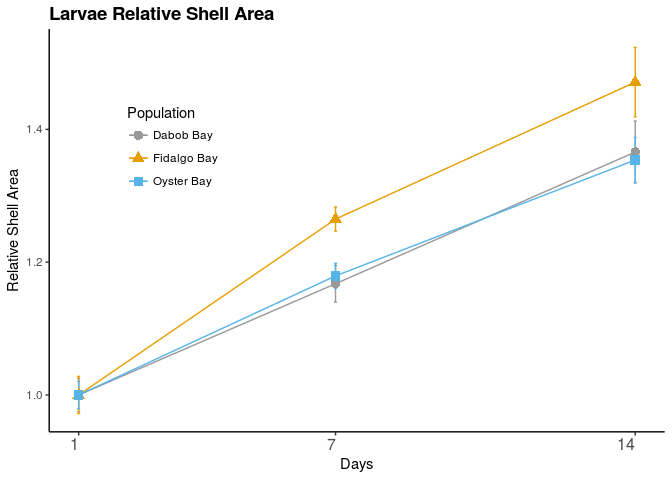

``` r
Area.Size$Date <- c(1,14,7,1,14,7,1,14,7)
Fig.Length.size <- ggplot(Area.Size, aes(x=Date, y=mean.RelLength, group=Population)) + 
  geom_errorbar(aes(ymin=Area.Size$mean.RelLength-Area.Size$se.RelLength,ymax=Area.Size$mean.RelLength+Area.Size$se.RelLength,color=Population), width=.07,position = position_dodge(width = 0.1)) +
  geom_line(aes(color=Population) ,size = 0.5,position = position_dodge(width = 0.1)) +   
  geom_point(aes(shape=Population,color=Population), size = 3,position = position_dodge(width = 0.1))+
  xlab("Days") +scale_x_continuous(breaks=c(1,7,14))+
  ylab(expression(paste("Relative Shell Length"))) +
  theme_bw() + #Set the background color
  theme(axis.text.x = element_text(vjust = 1, hjust=1, size = 12), #Set the text angle
        axis.line = element_line(color = 'black'), #Set the axes color
        panel.border = element_blank(), #Set the border
        panel.grid.major = element_blank(), #Set the major gridlines
        panel.grid.minor = element_blank(), #Set the minor gridlines
        plot.background=element_blank(),  #Set the plot background
        legend.key = element_blank(),  #remove legend background
        legend.position=c(.2, .7)) + #set legend location
  ggtitle("Larvae Relative Shell Length") +
  theme(plot.title = element_text(face = 'bold', 
                                  size = 14, 
                                  hjust = 0))
Fig.Length.size + scale_color_manual(values=c("#999999", "#E69F00", "#56B4E9"))
```

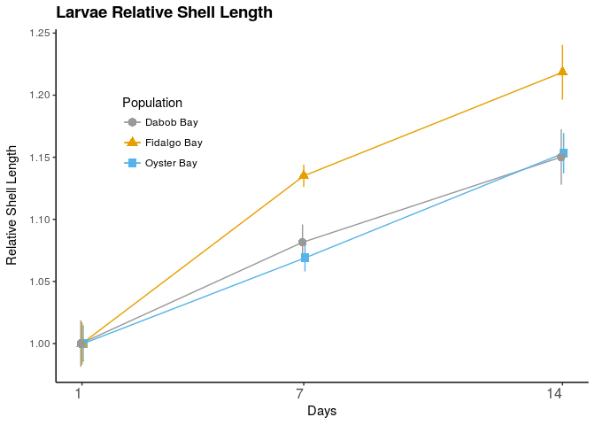 Day 7 area

``` r
G1.D7 <- filter(G1.all, Date == "7-8-15")
relarea.D7.model = lmer(A.rel ~ Population + (1|Replicate),data=G1.D7,na.action = na.omit)
summary(relarea.D7.model)
```

    ## Linear mixed model fit by REML t-tests use Satterthwaite approximations
    ##   to degrees of freedom [lmerMod]
    ## Formula: A.rel ~ Population + (1 | Replicate)
    ##    Data: G1.D7
    ## 
    ## REML criterion at convergence: -116.6
    ## 
    ## Scaled residuals: 
    ##      Min       1Q   Median       3Q      Max 
    ## -2.48259 -0.69402 -0.00118  0.63023  2.44122 
    ## 
    ## Random effects:
    ##  Groups    Name        Variance  Std.Dev. 
    ##  Replicate (Intercept) 4.341e-18 2.084e-09
    ##  Residual              1.741e-02 1.320e-01
    ## Number of obs: 108, groups:  Replicate, 9
    ## 
    ## Fixed effects:
    ##                        Estimate Std. Error        df t value Pr(>|t|)    
    ## (Intercept)             1.16755    0.02199 105.00000   53.09  < 2e-16 ***
    ## PopulationFidalgo Bay   0.09735    0.03110 105.00000    3.13  0.00226 ** 
    ## PopulationOyster Bay    0.01181    0.03110 105.00000    0.38  0.70500    
    ## ---
    ## Signif. codes:  0 '***' 0.001 '**' 0.01 '*' 0.05 '.' 0.1 ' ' 1
    ## 
    ## Correlation of Fixed Effects:
    ##             (Intr) PpltFB
    ## PpltnFdlgBy -0.707       
    ## PpltnOystrB -0.707  0.500

``` r
relarea.null <- lmer(A.rel ~ (1|Replicate),data=G1.D7,REML=FALSE)
relarea.model.R <- lmer(A.rel ~ Population + (1|Replicate),data=G1.D7,REML = F)
anova(relarea.null,relarea.model.R)
```

    ## Data: G1.D7
    ## Models:
    ## relarea.null: A.rel ~ (1 | Replicate)
    ## relarea.model.R: A.rel ~ Population + (1 | Replicate)
    ##                 Df     AIC     BIC logLik deviance  Chisq Chi Df
    ## relarea.null     3 -117.58 -109.53 61.789  -123.58              
    ## relarea.model.R  5 -124.00 -110.59 67.001  -134.00 10.425      2
    ##                 Pr(>Chisq)   
    ## relarea.null                 
    ## relarea.model.R   0.005449 **
    ## ---
    ## Signif. codes:  0 '***' 0.001 '**' 0.01 '*' 0.05 '.' 0.1 ' ' 1

Day 14 area

``` r
G1.D14 <- filter(G1.all, Date == "7-15-15")
relarea.D14.model = lmer(A.rel ~ Population + (1|Replicate),data=G1.D14,na.action = na.omit)
summary(relarea.D14.model)
```

    ## Linear mixed model fit by REML t-tests use Satterthwaite approximations
    ##   to degrees of freedom [lmerMod]
    ## Formula: A.rel ~ Population + (1 | Replicate)
    ##    Data: G1.D14
    ## 
    ## REML criterion at convergence: 25.4
    ## 
    ## Scaled residuals: 
    ##     Min      1Q  Median      3Q     Max 
    ## -2.0853 -0.7253 -0.1450  0.4781  2.5656 
    ## 
    ## Random effects:
    ##  Groups    Name        Variance Std.Dev.
    ##  Replicate (Intercept) 0.006973 0.08351 
    ##  Residual              0.064694 0.25435 
    ## Number of obs: 103, groups:  Replicate, 9
    ## 
    ## Fixed effects:
    ##                       Estimate Std. Error       df t value Pr(>|t|)    
    ## (Intercept)            1.36781    0.06461  5.83200  21.170 9.72e-07 ***
    ## PopulationFidalgo Bay  0.09977    0.09170  5.91000   1.088    0.319    
    ## PopulationOyster Bay  -0.01158    0.09170  5.91000  -0.126    0.904    
    ## ---
    ## Signif. codes:  0 '***' 0.001 '**' 0.01 '*' 0.05 '.' 0.1 ' ' 1
    ## 
    ## Correlation of Fixed Effects:
    ##             (Intr) PpltFB
    ## PpltnFdlgBy -0.705       
    ## PpltnOystrB -0.705  0.496

``` r
relarea.null <- lmer(A.rel ~ (1|Replicate),data=G1.D14,REML=FALSE)
relarea.model.R <- lmer(A.rel ~ Population + (1|Replicate),data=G1.D14,REML = FALSE)
anova(relarea.null,relarea.model.R)
```

    ## Data: G1.D14
    ## Models:
    ## relarea.null: A.rel ~ (1 | Replicate)
    ## relarea.model.R: A.rel ~ Population + (1 | Replicate)
    ##                 Df    AIC    BIC  logLik deviance  Chisq Chi Df Pr(>Chisq)
    ## relarea.null     3 22.208 30.112 -8.1041   16.208                         
    ## relarea.model.R  5 23.845 37.019 -6.9225   13.845 2.3633      2     0.3068

``` r
posthoc.kruskal.nemenyi.test(G1.D7$A.rel,as.factor(G1.D7$Population),dist="Chisquare")
```

    ## Warning in posthoc.kruskal.nemenyi.test.default(G1.D7$A.rel,
    ## as.factor(G1.D7$Population), : Ties are present. Chi-sq was corrected for
    ## ties.

    ## 
    ##  Pairwise comparisons using Nemenyi-test with Chi-squared    
    ##                        approximation for independent samples 
    ## 
    ## data:  G1.D7$A.rel and as.factor(G1.D7$Population) 
    ## 
    ##             Dabob Bay Fidalgo Bay
    ## Fidalgo Bay 0.018     -          
    ## Oyster Bay  1.000     0.018      
    ## 
    ## P value adjustment method: none

``` r
posthoc.kruskal.nemenyi.test(G1.D14$A.rel,as.factor(G1.D14$Population),dist="Chisquare")
```

    ## Warning in posthoc.kruskal.nemenyi.test.default(G1.D14$A.rel,
    ## as.factor(G1.D14$Population), : Ties are present. Chi-sq was corrected for
    ## ties.

    ## 
    ##  Pairwise comparisons using Nemenyi-test with Chi-squared    
    ##                        approximation for independent samples 
    ## 
    ## data:  G1.D14$A.rel and as.factor(G1.D14$Population) 
    ## 
    ##             Dabob Bay Fidalgo Bay
    ## Fidalgo Bay 0.42      -          
    ## Oyster Bay  0.99      0.48       
    ## 
    ## P value adjustment method: none
