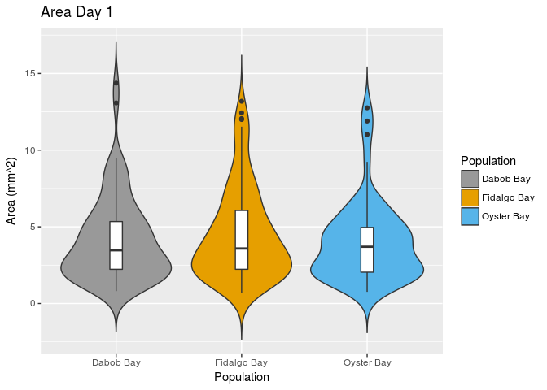
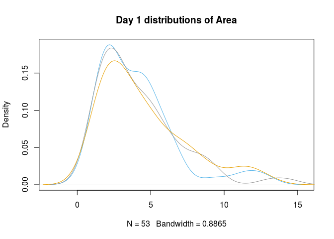
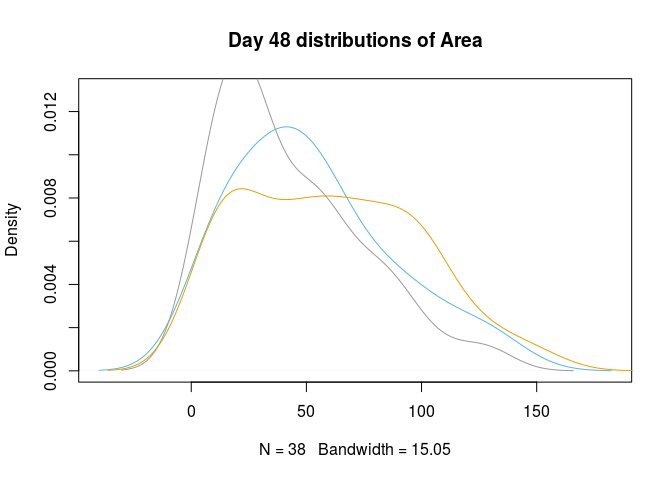
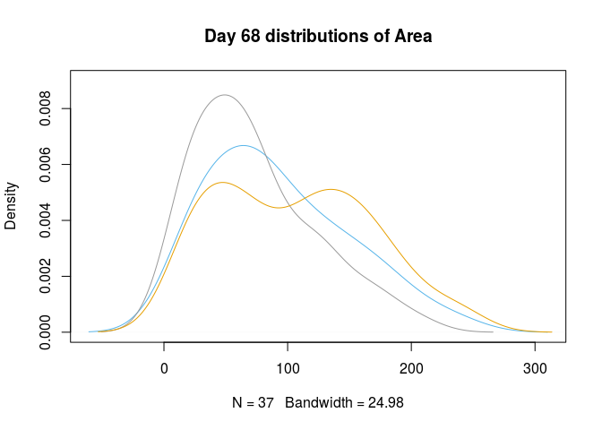
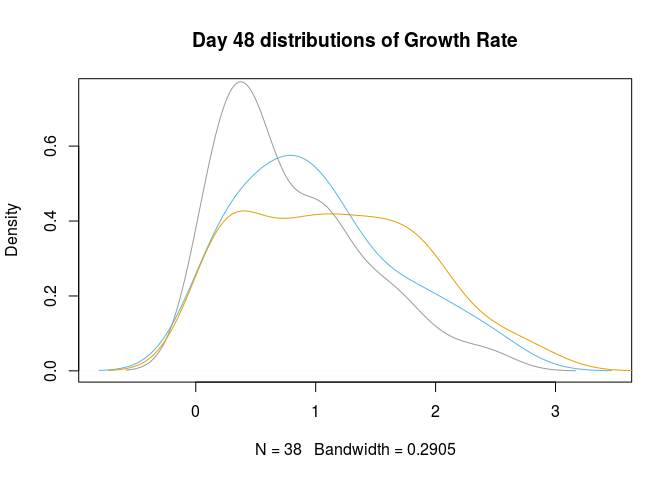
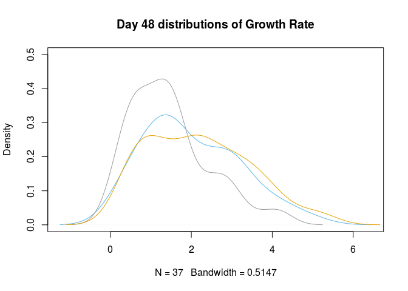
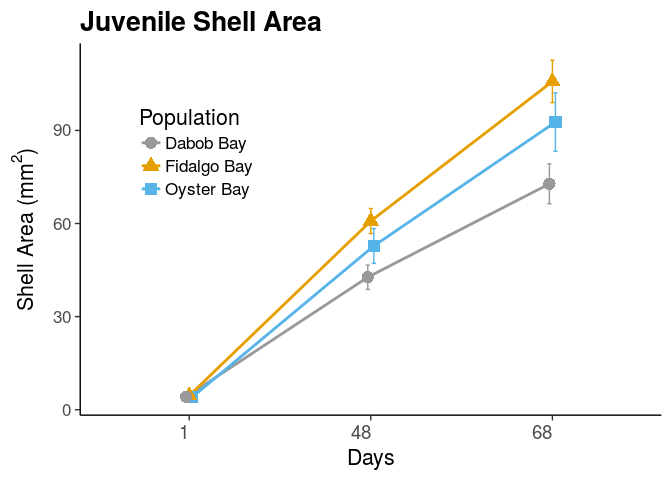
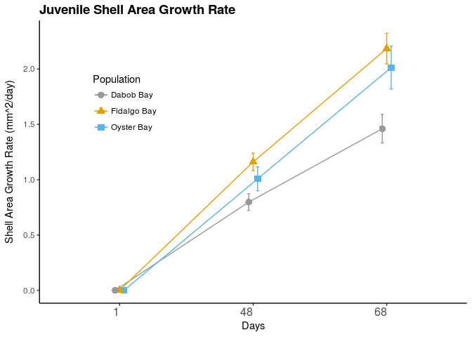
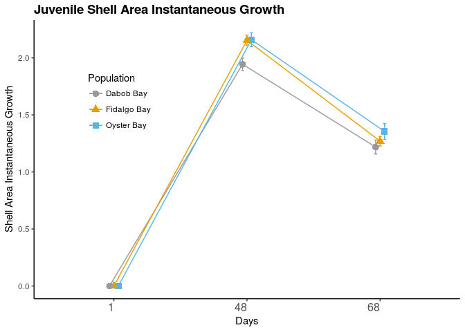
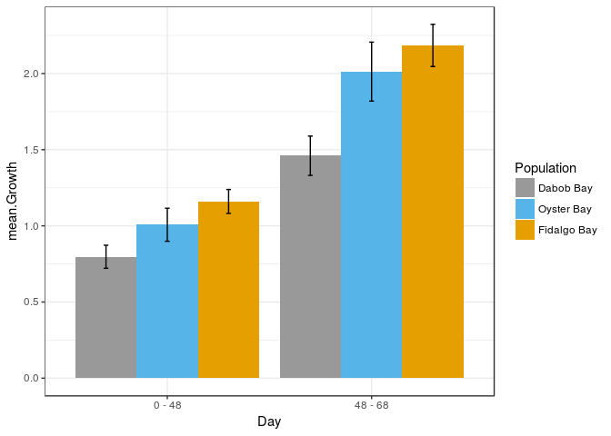

Puget Sound Juvenile Growth
================
Katherine Silliman

-   [Setting up](#setting-up)
-   [Summarizing at different time points](#summarizing-at-different-time-points)
-   [Checking for normal distributions](#checking-for-normal-distributions)
    -   [Day 1 Area](#day-1-area)
    -   [Day 48 Area](#day-48-area)
    -   [Day 68 Area](#day-68-area)
    -   [Growth rate](#growth-rate)
-   [Plotting size through time](#plotting-size-through-time)
-   [Testing for differences in size](#testing-for-differences-in-size)
    -   [Day 1](#day-1)
    -   [Day 48](#day-48)
    -   [Day 68](#day-68)
    -   [Kruskal-Wallis tests](#kruskal-wallis-tests)

Setting up
==========

``` r
library(dplyr) #data frame grouping
library(nlme) #LMMs, using likelihood ratio test for significance
library(plotrix)#for SE calculation
#library(multcompView)
library(ggplot2)
library(lme4) #for linear mixed models
library(afex) #different way for getting significance from LMMs
library(PMCMR) #Kruskal-Wallis test
```

Reading in file with measurements, generated in Google Sheets.

``` r
all.tiles <- read.csv("../../Data/Oyster Tile Size Data.csv",header = TRUE, na.strings = c("#DIV/0!","#VALUE!","e","gone","g","#NUM!","#REF!"))
```

Filter out oysters from B experiment, which were started 2 weeks later and had significantly higher mortality.

``` r
stack.1.A <- filter(all.tiles,A.or.B == "A",!is.na(Area.827)) %>% 
  select(Tile,Population,include, Status, Area.827, Area.1014,I.Growth.1014,Growth.1014,Area.113,I.Growth.113,Growth.113,Tray) %>%
    group_by(Population)
```

Make a new data frame with dates stacked on top of each other (easier to plot)

``` r
new.827 <- select(stack.1.A,Tile,Population,Area.827,Tray) %>%  mutate(Growth=0) %>%mutate(I.Growth=0) %>% mutate(Day = "1")
colnames(new.827) <- c("Tile","Population","Area","Tray","Growth","I.Growth","Day")
new.1014 <- filter(stack.1.A,include !="n", !is.na(Area.1014),Growth.1014>0) %>%
    select(Tile,Population,Area.1014,Tray,Growth.1014,I.Growth.1014) %>%
    mutate(Day = "48")
colnames(new.1014) <-c("Tile","Population","Area","Tray","Growth","I.Growth","Day")
new.113 <- filter(stack.1.A,include!="n", !is.na(Area.113),Growth.113>0) %>%
    select(Tile,Population,Area.113,Tray,Growth.113,I.Growth.113) %>%  mutate(Day = "68")
colnames(new.113) <-c("Tile","Population","Area","Tray","Growth","I.Growth","Day")
stack.1.A.ex.byDay <- rbind(new.827,new.1014,new.113)
stack.1.A.ex.byDay <- group_by(stack.1.A.ex.byDay,Day,Population)
```

Summarizing at different time points
====================================

``` r
Shell.Size = summarise(stack.1.A.ex.byDay,mean.Area = mean(Area, na.rm = T),se.Area = std.error(Area,na.rm =T),mean.Igrowth = mean(I.Growth,na.rm=T), se.Igrowth = std.error(I.Growth,na.rm=T),mean.Growth=mean(Growth,na.rm=T),se.Growth=std.error(Growth,na.rm=T))
head(Shell.Size)
```

    ## # A tibble: 6 x 8
    ## # Groups:   Day [2]
    ##     Day  Population mean.Area   se.Area mean.Igrowth se.Igrowth
    ##   <chr>      <fctr>     <dbl>     <dbl>        <dbl>      <dbl>
    ## 1     1   Dabob Bay  4.141200 0.3162099     0.000000 0.00000000
    ## 2     1 Fidalgo Bay  4.527105 0.2787447     0.000000 0.00000000
    ## 3     1  Oyster Bay  4.036038 0.3630286     0.000000 0.00000000
    ## 4    48   Dabob Bay 42.701905 3.9244300     1.943651 0.05388791
    ## 5    48 Fidalgo Bay 60.791910 4.0448533     2.153820 0.04319248
    ## 6    48  Oyster Bay 52.764211 5.6163443     2.158947 0.06090100
    ## # ... with 2 more variables: mean.Growth <dbl>, se.Growth <dbl>

Checking for normal distributions
=================================

Day 1 Area
----------

Plotting size distributions at Day 1.

``` r
p.Day1 <- ggplot(filter(stack.1.A.ex.byDay,Day == 1), aes(x=Population, y=Area,fill=Population)) + 
  geom_violin(trim=FALSE) + scale_fill_manual(values=c("#999999", "#E69F00", "#56B4E9")) + geom_boxplot(width=0.1,fill="white") + labs(title="Area Day 1",y="Area (mm^2)")
p.Day1
```

 Checking for normal distributions in Area.

``` r
#Day 1
plot(density(filter(stack.1.A.ex.byDay,Day==1,Population=="Oyster Bay")$Area,na.rm = T),col="#56B4E9", main ="Day 1 distributions of Area")
lines(density(filter(stack.1.A.ex.byDay,Day==1,Population=="Dabob Bay")$Area,na.rm = T),col="#999999")
lines(density(filter(stack.1.A.ex.byDay,Day==1,Population=="Fidalgo Bay")$Area,na.rm = T),col="#E69F00")
```



``` r
shapiro.test(filter(stack.1.A.ex.byDay,Day==1,Population=="Oyster Bay")$Area)
```

    ## 
    ##  Shapiro-Wilk normality test
    ## 
    ## data:  filter(stack.1.A.ex.byDay, Day == 1, Population == "Oyster Bay")$Area
    ## W = 0.84905, p-value = 8.823e-06

``` r
shapiro.test(filter(stack.1.A.ex.byDay,Day==1,Population=="Dabob Bay")$Area)
```

    ## 
    ##  Shapiro-Wilk normality test
    ## 
    ## data:  filter(stack.1.A.ex.byDay, Day == 1, Population == "Dabob Bay")$Area
    ## W = 0.87925, p-value = 3.371e-06

``` r
shapiro.test(filter(stack.1.A.ex.byDay,Day==1,Population=="Fidalgo Bay")$Area)
```

    ## 
    ##  Shapiro-Wilk normality test
    ## 
    ## data:  filter(stack.1.A.ex.byDay, Day == 1, Population == "Fidalgo Bay")$Area
    ## W = 0.89494, p-value = 1.966e-07

Day 1 Area is not normal.

Day 48 Area
-----------



    ## 
    ##  Shapiro-Wilk normality test
    ## 
    ## data:  filter(stack.1.A.ex.byDay, Day == 48, Population == "Oyster Bay")$Area
    ## W = 0.94396, p-value = 0.05637

    ## 
    ##  Shapiro-Wilk normality test
    ## 
    ## data:  filter(stack.1.A.ex.byDay, Day == 48, Population == "Dabob Bay")$Area
    ## W = 0.90996, p-value = 0.000218

    ## 
    ##  Shapiro-Wilk normality test
    ## 
    ## data:  filter(stack.1.A.ex.byDay, Day == 48, Population == "Fidalgo Bay")$Area
    ## W = 0.95561, p-value = 0.004032

Day 48 area is not normal, except for SS.

Day 68 Area
-----------



    ## 
    ##  Shapiro-Wilk normality test
    ## 
    ## data:  filter(stack.1.A.ex.byDay, Day == 68, Population == "Oyster Bay")$Area
    ## W = 0.94858, p-value = 0.08687

    ## 
    ##  Shapiro-Wilk normality test
    ## 
    ## data:  filter(stack.1.A.ex.byDay, Day == 68, Population == "Dabob Bay")$Area
    ## W = 0.93148, p-value = 0.0028

    ## 
    ##  Shapiro-Wilk normality test
    ## 
    ## data:  filter(stack.1.A.ex.byDay, Day == 68, Population == "Fidalgo Bay")$Area
    ## W = 0.95427, p-value = 0.00497

Shell area at day 68 does not have a normal distribution, except SS.

Growth rate
-----------

Checking for normal distribution of growth rate by Day 48 

    ## 
    ##  Shapiro-Wilk normality test
    ## 
    ## data:  filter(stack.1.A.ex.byDay, Day == 48, Population == "Oyster Bay",     Growth > 0)$Growth
    ## W = 0.94738, p-value = 0.07302

    ## 
    ##  Shapiro-Wilk normality test
    ## 
    ## data:  filter(stack.1.A.ex.byDay, Day == 48, Population == "Dabob Bay",     Growth > 0)$Growth
    ## W = 0.9121, p-value = 0.0002648

    ## 
    ##  Shapiro-Wilk normality test
    ## 
    ## data:  filter(stack.1.A.ex.byDay, Day == 48, Population == "Fidalgo Bay",     Growth > 0)$Growth
    ## W = 0.95644, p-value = 0.00456

HC and NF not normal. Checking for normal distribution of growth rate 48 - 68 

    ## 
    ##  Shapiro-Wilk normality test
    ## 
    ## data:  filter(stack.1.A.ex.byDay, Day == 68, Population == "Oyster Bay")$Growth
    ## W = 0.95513, p-value = 0.1412

    ## 
    ##  Shapiro-Wilk normality test
    ## 
    ## data:  filter(stack.1.A.ex.byDay, Day == 68, Population == "Dabob Bay")$Growth
    ## W = 0.92621, p-value = 0.001695

    ## 
    ##  Shapiro-Wilk normality test
    ## 
    ## data:  filter(stack.1.A.ex.byDay, Day == 68, Population == "Fidalgo Bay")$Growth
    ## W = 0.95778, p-value = 0.008139

HC and NF not normal.

Plotting size through time
==========================

``` r
Fig.Line.size <- ggplot(Shell.Size, aes(x=Day, y=mean.Area, group=Population)) + 
  geom_errorbar(aes(ymin=Shell.Size$mean.Area-Shell.Size$se.Area,ymax=Shell.Size$mean.Area+Shell.Size$se.Area,color=Population), width=.07,position = position_dodge(width = 0.05)) +
  geom_line(aes(color=Population) ,size = 1,position = position_dodge(width = 0.05)) +   
  geom_point(aes(shape=Population,color=Population), size = 4,position = position_dodge(width = 0.05))+
  xlab("Days") +
  ylab(expression(paste('Shell Area (',mm^2,')'))) +
  theme_bw(base_size = 16) + #Set the background color
  theme(axis.text.x = element_text(vjust = 1, hjust=1, size = 14), #Set the text angle
        axis.line = element_line(color = 'black'), #Set the axes color
        panel.border = element_blank(), #Set the border
        panel.grid.major = element_blank(), #Set the major gridlines
        panel.grid.minor = element_blank(), #Set the minor gridlines
        plot.background=element_blank(),  #Set the plot background
        legend.key = element_blank(),  #remove legend background
        legend.position=c(.2, .7)) + #set legend location
  ggtitle("Juvenile Shell Area") +
  theme(plot.title = element_text(face = 'bold', 
                                  size = 20, 
                                  hjust = 0))
Fig.Line.size + scale_color_manual(values=c("#999999", "#E69F00", "#56B4E9"))
```



``` r
Fig.Line.size <- ggplot(Shell.Size, aes(x=Day, y=mean.Growth, group=Population)) + 
  geom_errorbar(aes(ymin=Shell.Size$mean.Growth-Shell.Size$se.Growth,ymax=Shell.Size$mean.Growth+Shell.Size$se.Growth,color=Population), width=.07,position = position_dodge(width = 0.1)) +
  geom_line(aes(color=Population) ,size = 0.5,position = position_dodge(width = 0.1)) +   
  geom_point(aes(shape=Population,color=Population), size = 3,position = position_dodge(width = 0.1))+
  xlab("Days") +
  ylab(expression(paste("Shell Area Growth Rate (mm^2/day)"))) +
  theme_bw() + #Set the background color
  theme(axis.text.x = element_text(vjust = 1, hjust=1, size = 12), #Set the text angle
        axis.line = element_line(color = 'black'), #Set the axes color
        panel.border = element_blank(), #Set the border
        panel.grid.major = element_blank(), #Set the major gridlines
        panel.grid.minor = element_blank(), #Set the minor gridlines
        plot.background=element_blank(),  #Set the plot background
        legend.key = element_blank(),  #remove legend background
        legend.position=c(.2, .7)) + #set legend location
  ggtitle("Juvenile Shell Area Growth Rate") +
  theme(plot.title = element_text(face = 'bold', 
                                  size = 14, 
                                  hjust = 0))
Fig.Line.size + scale_color_manual(values=c("#999999", "#E69F00", "#56B4E9"))
```



Instantaneous growth- not used in paper, but here for reference.

``` r
Fig.Line.size <- ggplot(Shell.Size, aes(x=Day, y=mean.Igrowth, group=Population)) + 
  geom_errorbar(aes(ymin=Shell.Size$mean.Igrowth-Shell.Size$se.Igrowth,ymax=Shell.Size$mean.Igrowth+Shell.Size$se.Igrowth,color=Population), width=.07,position = position_dodge(width = 0.1)) +
  geom_line(aes(color=Population) ,size = 0.5,position = position_dodge(width = 0.1)) +   
  geom_point(aes(shape=Population,color=Population), size = 3,position = position_dodge(width = 0.1))+
  xlab("Days") +
  ylab(expression(paste("Shell Area Instantaneous Growth"))) +
  theme_bw() + #Set the background color
  theme(axis.text.x = element_text(vjust = 1, hjust=1, size = 12), #Set the text angle
        axis.line = element_line(color = 'black'), #Set the axes color
        panel.border = element_blank(), #Set the border
        panel.grid.major = element_blank(), #Set the major gridlines
        panel.grid.minor = element_blank(), #Set the minor gridlines
        plot.background=element_blank(),  #Set the plot background
        legend.key = element_blank(),  #remove legend background
        legend.position=c(.2, .7)) + #set legend location
  ggtitle("Juvenile Shell Area Instantaneous Growth") +
  theme(plot.title = element_text(face = 'bold', 
                                  size = 14, 
                                  hjust = 0))
Fig.Line.size + scale_color_manual(values=c("#999999", "#E69F00", "#56B4E9"))
```



``` r
SS <- filter(Shell.Size, Day != "1")
SS$Population <- factor(SS$Population,levels =c("Dabob Bay","Oyster Bay","Fidalgo Bay"))
Bar.size <- ggplot(SS, aes(x=Day, y=mean.Growth, fill=Population)) + 
  geom_bar(stat="identity", position=position_dodge()) +
  theme_bw() +
  geom_errorbar(aes(ymin=SS$mean.Growth-SS$se.Growth,ymax=SS$mean.Growth+SS$se.Growth), width=.07,position = position_dodge(0.9)) +
  scale_fill_manual(values=c("#999999", "#56B4E9","#E69F00" )) + 
  scale_x_discrete(labels = c("48" ="0 - 48","68" = "48 - 68"))
Bar.size
```



Testing for differences in size
===============================

Day 1
-----

ANOVA of size at Day 1 to test if size differs accross populations at Day 1

``` r
G1.D1 <- filter(stack.1.A.ex.byDay, Day==1)
area.D1 <- aov(log10(Area) ~ Population, data=G1.D1) #test the hypothesis relative size does not differ between treatments on Day 1
summary(area.D1)
```

    ##              Df Sum Sq Mean Sq F value Pr(>F)
    ## Population    2  0.078 0.03895   0.483  0.617
    ## Residuals   239 19.268 0.08062

Linear mixed models of size at each time point, with Population as a fixed effect and Tray as random effect. Log-transformed area on Day 1

``` r
D1 <- filter(stack.1.A.ex.byDay, Day == 1)
area.model = lmer(log10(Area) ~ Population + (1|Tray),data=D1,na.action = na.omit)
summary(area.model)
```

    ## Linear mixed model fit by REML t-tests use Satterthwaite approximations
    ##   to degrees of freedom [lmerMod]
    ## Formula: log10(Area) ~ Population + (1 | Tray)
    ##    Data: D1
    ## 
    ## REML criterion at convergence: 86.4
    ## 
    ## Scaled residuals: 
    ##      Min       1Q   Median       3Q      Max 
    ## -2.34337 -0.71705 -0.01801  0.75945  2.26876 
    ## 
    ## Random effects:
    ##  Groups   Name        Variance Std.Dev.
    ##  Tray     (Intercept) 0.009196 0.0959  
    ##  Residual             0.077880 0.2791  
    ## Number of obs: 242, groups:  Tray, 4
    ## 
    ## Fixed effects:
    ##                        Estimate Std. Error        df t value Pr(>|t|)   
    ## (Intercept)             0.49766    0.05976   3.04000   8.328  0.00347 **
    ## PopulationFidalgo Bay   0.08936    0.04594 167.34000   1.945  0.05344 . 
    ## PopulationOyster Bay    0.01548    0.05230 230.31000   0.296  0.76754   
    ## ---
    ## Signif. codes:  0 '***' 0.001 '**' 0.01 '*' 0.05 '.' 0.1 ' ' 1
    ## 
    ## Correlation of Fixed Effects:
    ##             (Intr) PpltFB
    ## PpltnFdlgBy -0.442       
    ## PpltnOystrB -0.328  0.514

``` r
area.null <- lmer(log10(Area) ~ (1|Tray),data=D1,REML=FALSE)
area.model.R <- lmer(log10(Area) ~ Population + (1|Tray),data=D1,REML = F)
anova(area.null,area.model.R)
```

    ## Data: D1
    ## Models:
    ## area.null: log10(Area) ~ (1 | Tray)
    ## area.model.R: log10(Area) ~ Population + (1 | Tray)
    ##              Df    AIC     BIC  logLik deviance  Chisq Chi Df Pr(>Chisq)
    ## area.null     3 81.369  91.836 -37.684   75.369                         
    ## area.model.R  5 83.313 100.757 -36.656   73.313 2.0561      2     0.3577

Not significant.

Day 48
------

Log-transformed shell area on Day 48.

``` r
D48 <- filter(stack.1.A.ex.byDay, Day == 48, !(is.na(Area)))
area.model = lmer(log10(Area) ~ Population + (1|Tray),data=D48,na.action = na.omit)
summary(area.model)
```

    ## Linear mixed model fit by REML t-tests use Satterthwaite approximations
    ##   to degrees of freedom [lmerMod]
    ## Formula: log10(Area) ~ Population + (1 | Tray)
    ##    Data: D48
    ## 
    ## REML criterion at convergence: 167.5
    ## 
    ## Scaled residuals: 
    ##     Min      1Q  Median      3Q     Max 
    ## -2.5036 -0.6142  0.1807  0.7809  1.7054 
    ## 
    ## Random effects:
    ##  Groups   Name        Variance Std.Dev.
    ##  Tray     (Intercept) 0.008241 0.09078 
    ##  Residual             0.131902 0.36318 
    ## Number of obs: 190, groups:  Tray, 4
    ## 
    ## Fixed effects:
    ##                        Estimate Std. Error        df t value Pr(>|t|)    
    ## (Intercept)             1.48046    0.06733   2.38000  21.988 0.000837 ***
    ## PopulationFidalgo Bay   0.20342    0.06434  86.69000   3.162 0.002162 ** 
    ## PopulationOyster Bay    0.11533    0.07665 174.72000   1.505 0.134197    
    ## ---
    ## Signif. codes:  0 '***' 0.001 '**' 0.01 '*' 0.05 '.' 0.1 ' ' 1
    ## 
    ## Correlation of Fixed Effects:
    ##             (Intr) PpltFB
    ## PpltnFdlgBy -0.548       
    ## PpltnOystrB -0.398  0.474

``` r
area.null <- lmer(log10(Area) ~ (1|Tray),data=D48,REML=FALSE)
area.model.R <- lmer(log10(Area) ~ Population + (1|Tray),data=D48,REML = F)
anova(area.null,area.model.R)
```

    ## Data: D48
    ## Models:
    ## area.null: log10(Area) ~ (1 | Tray)
    ## area.model.R: log10(Area) ~ Population + (1 | Tray)
    ##              Df    AIC    BIC  logLik deviance  Chisq Chi Df Pr(>Chisq)  
    ## area.null     3 168.45 178.19 -81.224   162.45                           
    ## area.model.R  5 165.22 181.46 -77.611   155.22 7.2262      2    0.02697 *
    ## ---
    ## Signif. codes:  0 '***' 0.001 '**' 0.01 '*' 0.05 '.' 0.1 ' ' 1

p-value is 0.02188

Log-transformed growth rate, Day 1 to Day 48.

    ## Linear mixed model fit by REML t-tests use Satterthwaite approximations
    ##   to degrees of freedom [lmerMod]
    ## Formula: log10(Growth) ~ Population + (1 | Tray)
    ##    Data: D48
    ## 
    ## REML criterion at convergence: 191
    ## 
    ## Scaled residuals: 
    ##     Min      1Q  Median      3Q     Max 
    ## -2.7674 -0.6191  0.1794  0.7752  1.6346 
    ## 
    ## Random effects:
    ##  Groups   Name        Variance Std.Dev.
    ##  Tray     (Intercept) 0.008714 0.09335 
    ##  Residual             0.149727 0.38695 
    ## Number of obs: 190, groups:  Tray, 4
    ## 
    ## Fixed effects:
    ##                        Estimate Std. Error        df t value Pr(>|t|)   
    ## (Intercept)            -0.26235    0.07054   2.35000  -3.719  0.05061 . 
    ## PopulationFidalgo Bay   0.21746    0.06839  82.89000   3.180  0.00207 **
    ## PopulationOyster Bay    0.12968    0.08159 173.48000   1.589  0.11378   
    ## ---
    ## Signif. codes:  0 '***' 0.001 '**' 0.01 '*' 0.05 '.' 0.1 ' ' 1
    ## 
    ## Correlation of Fixed Effects:
    ##             (Intr) PpltFB
    ## PpltnFdlgBy -0.557       
    ## PpltnOystrB -0.405  0.474

    ## Data: D48
    ## Models:
    ## area.null: log10(Growth) ~ (1 | Tray)
    ## area.model.R: log10(Growth) ~ Population + (1 | Tray)
    ##              Df    AIC    BIC  logLik deviance  Chisq Chi Df Pr(>Chisq)  
    ## area.null     3 192.75 202.49 -93.376   186.75                           
    ## area.model.R  5 189.15 205.39 -89.576   179.15 7.6011      2    0.02236 *
    ## ---
    ## Signif. codes:  0 '***' 0.001 '**' 0.01 '*' 0.05 '.' 0.1 ' ' 1

p-value = 0.01824

Day 68
------

Log-transformed Area Day 68

``` r
D68 <- filter(stack.1.A.ex.byDay, Day == 68, !(is.na(Area)))
area.model = lmer(log10(Area) ~ Population + (1|Tray),data=D68,na.action = na.omit)
summary(area.model)
```

    ## Linear mixed model fit by REML t-tests use Satterthwaite approximations
    ##   to degrees of freedom [lmerMod]
    ## Formula: log10(Area) ~ Population + (1 | Tray)
    ##    Data: D68
    ## 
    ## REML criterion at convergence: 123.1
    ## 
    ## Scaled residuals: 
    ##     Min      1Q  Median      3Q     Max 
    ## -2.5233 -0.6157  0.1830  0.7836  1.7592 
    ## 
    ## Random effects:
    ##  Groups   Name        Variance Std.Dev.
    ##  Tray     (Intercept) 0.004295 0.06554 
    ##  Residual             0.108886 0.32998 
    ## Number of obs: 178, groups:  Tray, 4
    ## 
    ## Fixed effects:
    ##                        Estimate Std. Error        df t value Pr(>|t|)    
    ## (Intercept)             1.73183    0.05701   2.56000  30.378 0.000243 ***
    ## PopulationFidalgo Bay   0.20271    0.05981  66.90000   3.389 0.001179 ** 
    ## PopulationOyster Bay    0.12489    0.07103 154.88000   1.758 0.080668 .  
    ## ---
    ## Signif. codes:  0 '***' 0.001 '**' 0.01 '*' 0.05 '.' 0.1 ' ' 1
    ## 
    ## Correlation of Fixed Effects:
    ##             (Intr) PpltFB
    ## PpltnFdlgBy -0.615       
    ## PpltnOystrB -0.462  0.483

``` r
area.null <- lmer(log10(Area)~ (1|Tray),data=D68,REML=FALSE)
area.model.R <- lmer(log10(Area) ~ Population + (1|Tray),data=D68,REML = F)
anova(area.null,area.model.R)
```

    ## Data: D68
    ## Models:
    ## area.null: log10(Area) ~ (1 | Tray)
    ## area.model.R: log10(Area) ~ Population + (1 | Tray)
    ##              Df    AIC    BIC  logLik deviance  Chisq Chi Df Pr(>Chisq)   
    ## area.null     3 125.80 135.35 -59.901   119.80                            
    ## area.model.R  5 120.15 136.06 -55.074   110.15 9.6551      2   0.008006 **
    ## ---
    ## Signif. codes:  0 '***' 0.001 '**' 0.01 '*' 0.05 '.' 0.1 ' ' 1

p-value is 0.007936

Log-transformed growth rate, Day 48 to Day 68.

    ## Linear mixed model fit by REML t-tests use Satterthwaite approximations
    ##   to degrees of freedom [lmerMod]
    ## Formula: log10(Growth) ~ Population + (1 | Tray)
    ##    Data: D68
    ## 
    ## REML criterion at convergence: 118.1
    ## 
    ## Scaled residuals: 
    ##     Min      1Q  Median      3Q     Max 
    ## -3.2866 -0.5634  0.2213  0.7242  1.7606 
    ## 
    ## Random effects:
    ##  Groups   Name        Variance  Std.Dev. 
    ##  Tray     (Intercept) 9.298e-17 9.643e-09
    ##  Residual             1.073e-01 3.276e-01
    ## Number of obs: 178, groups:  Tray, 4
    ## 
    ## Fixed effects:
    ##                        Estimate Std. Error        df t value Pr(>|t|)    
    ## (Intercept)             0.04514    0.04301 175.00000   1.049 0.295448    
    ## PopulationFidalgo Bay   0.20366    0.05606 175.00000   3.633 0.000368 ***
    ## PopulationOyster Bay    0.16758    0.06892 175.00000   2.431 0.016050 *  
    ## ---
    ## Signif. codes:  0 '***' 0.001 '**' 0.01 '*' 0.05 '.' 0.1 ' ' 1
    ## 
    ## Correlation of Fixed Effects:
    ##             (Intr) PpltFB
    ## PpltnFdlgBy -0.767       
    ## PpltnOystrB -0.624  0.479

    ## Data: D68
    ## Models:
    ## area.null: log10(Growth) ~ (1 | Tray)
    ## area.model.R: log10(Growth) ~ Population + (1 | Tray)
    ##              Df    AIC    BIC  logLik deviance  Chisq Chi Df Pr(>Chisq)   
    ## area.null     3 124.35 133.89 -59.173   118.35                            
    ## area.model.R  5 114.82 130.73 -52.410   104.82 13.527      2   0.001155 **
    ## ---
    ## Signif. codes:  0 '***' 0.001 '**' 0.01 '*' 0.05 '.' 0.1 ' ' 1

p-value is 0.001133

Kruskal-Wallis tests
--------------------

Kruskal-Wallis test, with Nemenyi post-hoc test Shell Area

``` r
posthoc.kruskal.nemenyi.test(D1$Area,D1$Population,dist="Chisquare")
```

    ## Warning in posthoc.kruskal.nemenyi.test.default(D1$Area, D1$Population, :
    ## Ties are present. Chi-sq was corrected for ties.

    ## 
    ##  Pairwise comparisons using Nemenyi-test with Chi-squared    
    ##                        approximation for independent samples 
    ## 
    ## data:  D1$Area and D1$Population 
    ## 
    ##             Dabob Bay Fidalgo Bay
    ## Fidalgo Bay 0.77      -          
    ## Oyster Bay  0.98      0.68       
    ## 
    ## P value adjustment method: none

``` r
posthoc.kruskal.nemenyi.test(D48$Area,D48$Population,dist="Chisquare")
```

    ## Warning in posthoc.kruskal.nemenyi.test.default(D48$Area, D48$Population, :
    ## Ties are present. Chi-sq was corrected for ties.

    ## 
    ##  Pairwise comparisons using Nemenyi-test with Chi-squared    
    ##                        approximation for independent samples 
    ## 
    ## data:  D48$Area and D48$Population 
    ## 
    ##             Dabob Bay Fidalgo Bay
    ## Fidalgo Bay 0.013     -          
    ## Oyster Bay  0.390     0.570      
    ## 
    ## P value adjustment method: none

``` r
posthoc.kruskal.nemenyi.test(D68$Area,D68$Population,dist="Chisquare")
```

    ## Warning in posthoc.kruskal.nemenyi.test.default(D68$Area, D68$Population, :
    ## Ties are present. Chi-sq was corrected for ties.

    ## 
    ##  Pairwise comparisons using Nemenyi-test with Chi-squared    
    ##                        approximation for independent samples 
    ## 
    ## data:  D68$Area and D68$Population 
    ## 
    ##             Dabob Bay Fidalgo Bay
    ## Fidalgo Bay 0.0083    -          
    ## Oyster Bay  0.2656    0.6390     
    ## 
    ## P value adjustment method: none

HC and NF are significantly different at Day 48 and 68

Growth Rate

``` r
posthoc.kruskal.nemenyi.test(D48$Growth,D48$Population,dist="Chisquare")
```

    ## Warning in posthoc.kruskal.nemenyi.test.default(D48$Growth,
    ## D48$Population, : Ties are present. Chi-sq was corrected for ties.

    ## 
    ##  Pairwise comparisons using Nemenyi-test with Chi-squared    
    ##                        approximation for independent samples 
    ## 
    ## data:  D48$Growth and D48$Population 
    ## 
    ##             Dabob Bay Fidalgo Bay
    ## Fidalgo Bay 0.011     -          
    ## Oyster Bay  0.330     0.617      
    ## 
    ## P value adjustment method: none

``` r
posthoc.kruskal.nemenyi.test(D68$Growth,D68$Population,dist="Chisquare")
```

    ## Warning in posthoc.kruskal.nemenyi.test.default(D68$Growth,
    ## D68$Population, : Ties are present. Chi-sq was corrected for ties.

    ## 
    ##  Pairwise comparisons using Nemenyi-test with Chi-squared    
    ##                        approximation for independent samples 
    ## 
    ## data:  D68$Growth and D68$Population 
    ## 
    ##             Dabob Bay Fidalgo Bay
    ## Fidalgo Bay 0.0027    -          
    ## Oyster Bay  0.0806    0.8411     
    ## 
    ## P value adjustment method: none
