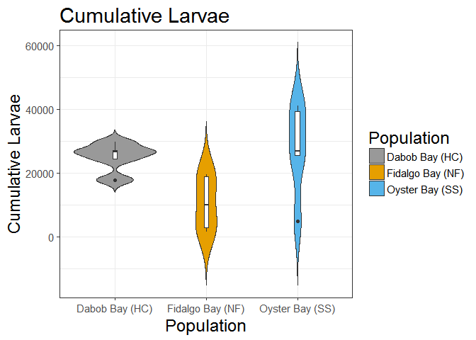

Puget Sound Reproduction 2015
================
Katherine Silliman

-   [Read in data](#read-in-data)
-   [Make Graphs](#make-graphs)
-   [Using family as replicates](#using-family-as-replicates)
    -   [Anova and Tukey HSD](#anova-and-tukey-hsd)
    -   [2-way ANOVA](#way-anova)
    -   [Checking for normal distribution](#checking-for-normal-distribution)
    -   [Test for differences among populations](#test-for-differences-among-populations)
    -   [GLM method (not pursuing)](#glm-method-not-pursuing)

``` r
library(ggplot2) #for plotting
```

    ## Warning: package 'ggplot2' was built under R version 3.3.3

``` r
library(dplyr) #Data summary
library(plotrix)#for SE calculation
```

    ## Warning: package 'plotrix' was built under R version 3.3.3

``` r
library(grid) #for plotting
library(PMCMR) #Kruskal-Wallis test
```

    ## Warning: package 'PMCMR' was built under R version 3.3.3

Read in data
============

``` r
larvae = read.csv("F:/ksilliman/Projects/PS_CommonG/Analysis/Phenotype/Larval counts - Day 1-By Family.csv", header = TRUE)
pop_larvae <- subset(larvae, select = c(Date,Population,Family,Total.Larvae,Total.per.capita)) %>% 
  filter(Family != "") %>% 
  group_by(Date,Population)
pop_larvae$Date <- as.Date(pop_larvae$Date, "%m/%d/%Y")
pop_larvae <- arrange(pop_larvae, Date) %>% 
  mutate(CalDay = format(Date,"%j"))

#Calculate total larvae released across families
pop_total <- summarise(pop_larvae, total.by.date = sum(Total.Larvae))

percap.norms <- function(x) {  #write function
  if(x == "Oyster Bay (SS)") y <- 99 
  if(x == "Dabob Bay (HC)") y <- 94 
  if(x == "Fidalgo Bay (NF)") y <- 99 
  return(y) #return result
}
pop_total$percap.norm <- as.numeric(sapply(pop_total$Population,percap.norms))
pop_total$total.per.cap <- pop_total$total.by.date/pop_total$percap.norm 
#Calculate cumulative larvae released through time
pop_total <- group_by(pop_total, Population) %>% mutate(cum.total=cumsum(total.by.date),cum.percap = cumsum(total.per.cap),CalDay = format(Date,"%j")) %>% arrange(Date) %>% select(Date,CalDay,Population,total.by.date,total.per.cap,cum.total,cum.percap)
pop_total
```

    ## Source: local data frame [81 x 7]
    ## Groups: Population [3]
    ## 
    ## # A tibble: 81 x 7
    ##          Date CalDay       Population total.by.date total.per.cap
    ##        <date>  <chr>           <fctr>         <dbl>         <dbl>
    ##  1 2015-06-19    170   Dabob Bay (HC)      29000.00     308.51064
    ##  2 2015-06-19    170 Fidalgo Bay (NF)          0.00       0.00000
    ##  3 2015-06-19    170  Oyster Bay (SS)      81100.00     819.19192
    ##  4 2015-06-22    173   Dabob Bay (HC)      54600.00     580.85106
    ##  5 2015-06-22    173 Fidalgo Bay (NF)          0.00       0.00000
    ##  6 2015-06-22    173  Oyster Bay (SS)     273487.50    2762.50000
    ##  7 2015-06-24    175   Dabob Bay (HC)      42888.00     456.25532
    ##  8 2015-06-24    175 Fidalgo Bay (NF)      69765.62     704.70328
    ##  9 2015-06-24    175  Oyster Bay (SS)       5000.00      50.50505
    ## 10 2015-06-25    176   Dabob Bay (HC)     126874.75    1349.73138
    ## # ... with 71 more rows, and 2 more variables: cum.total <dbl>,
    ## #   cum.percap <dbl>

Make Graphs
===========

Stacked graphs of cumulative larvae through time and number of larvae released by date

``` r
b <- ggplot(data=pop_total, aes(x=Date, y=total.by.date, group=Population, fill=Population)) + 
  geom_bar(stat="identity",position=position_dodge()) + ylab("Number of Larve Released")+
  ggtitle("Timing of Larvae Release by Population") + 
  scale_x_date(date_breaks = "1 week",date_labels ="%b-%d")+
  scale_fill_manual(values=c("#999999", "#E69F00", "#56B4E9"))+theme_bw() 

l <- ggplot(data=pop_total, aes(x=Date, y=cum.total, group=Population, colour=Population)) +
  geom_line() + geom_point() + ylab("Number of Larve Released") +
  scale_x_date(date_breaks = "1 week",date_labels ="%b-%d")+
  scale_color_manual(values=c("#999999", "#E69F00", "#56B4E9"))+theme_bw() 
grid.newpage()
grid.draw(rbind(ggplotGrob(b),ggplotGrob(l),size="last"))
```


``` r
bb <- ggplot(data=pop_total, aes(x=Date, y=total.per.cap, group=Population, fill=Population)) + 
  geom_bar(stat="identity",position=position_dodge()) + ylab("Number of Larve Released")+
  ggtitle("Timing of Larvae Per Capita Release by Population") + 
  scale_x_date(date_breaks = "1 week",date_labels ="%b-%d")+
  scale_fill_manual(values=c("#999999", "#E69F00", "#56B4E9"))+theme_bw() 

ll <- ggplot(data=pop_total, aes(x=Date, y=cum.percap, group=Population, colour=Population)) +
  geom_line() + geom_point() + ylab("Number of Larve Released") +
  scale_x_date(date_breaks = "1 week",date_labels ="%b-%d")+
  scale_color_manual(values=c("#999999", "#E69F00", "#56B4E9"))+theme_bw() 
grid.newpage()
grid.draw(rbind(ggplotGrob(bb),ggplotGrob(ll),size="last"))
```


Make graph with cumulative larvae overlaying bar graph

``` r
b <- b + geom_line(data=pop_total, aes(x=Date, y=cum.total/4, group=Population, colour=Population)) +
  scale_color_manual(values=c("#999999", "#E69F00", "#56B4E9"))+theme_bw() +
  scale_y_continuous(sec.axis = sec_axis(~.*4,name="Cumulative Larvae Released"))
b
```

 Make graph with cumulative larvae overlaying bar graph

``` r
bb <- bb + geom_line(data=pop_total, aes(x=Date, y=cum.percap/4, group=Population, colour=Population)) +
  scale_color_manual(values=c("#999999", "#E69F00", "#56B4E9"))+theme_bw() +
  scale_y_continuous(sec.axis = sec_axis(~.*4,name="Cumulative Larvae Released"))
bb
```


Using family as replicates
==========================

``` r
family_larvae <- group_by(pop_larvae,Family) %>% filter(Family !="")
fam.sum <- summarize(family_larvae, overall_Total = sum(Total.Larvae, na.rm = T), mean.larvae = mean(Total.Larvae,na.rm=T), se.larvae = std.error(Total.Larvae,na.rm=T), mean.percap = mean(Total.per.capita,na.rm=T), total.percap = sum(Total.per.capita,na.rm=T), maxday = as.numeric(CalDay[which.max(Total.Larvae)]), max = max(Total.Larvae), max.percap = max(Total.per.capita), Population = first(Population), first.big = as.numeric(CalDay[which(Total.Larvae > 0)[1]]))
fam.sum
```

    ## # A tibble: 15 x 11
    ##    Family overall_Total mean.larvae  se.larvae mean.percap total.percap
    ##    <fctr>         <dbl>       <dbl>      <dbl>       <dbl>        <dbl>
    ##  1    HC1      340167.0   12598.778  4061.4907   663.09357    17903.526
    ##  2    HC2      533017.8   19741.398  6026.0102   987.06991    26650.888
    ##  3    HC3      513696.6   19025.799  6694.4990  1001.35786    27036.662
    ##  4    HC4      488155.4   18079.830  6141.8419   903.99151    24407.771
    ##  5    HC5      476112.2   17633.787  5565.9879  1102.11169    29757.016
    ##  6    NF1      409650.2   15172.231  7408.7668   722.48721    19507.155
    ##  7    NF2      378520.8   14019.290  6306.2973   700.96451    18926.042
    ##  8    NF3       60000.0    2222.222  1628.4936   111.11111     3000.000
    ##  9    NF4       28237.0    1045.815   945.9845    55.04288     1486.158
    ## 10    NF5      190445.6    7053.542  3090.7216   371.23904    10023.454
    ## 11    SS1      536819.0   19882.185  6862.1913   994.10926    26840.950
    ## 12    SS2      486085.0   18003.148  7882.1377   947.53411    25583.421
    ## 13    SS3      862895.2   31959.080 13709.2035  1521.86096    41090.246
    ## 14    SS4      785626.4   29097.272 12491.9852  1454.86362    39281.318
    ## 15    SS5       92521.0    3426.704  2582.6451   180.35283     4869.526
    ## # ... with 5 more variables: maxday <dbl>, max <dbl>, max.percap <dbl>,
    ## #   Population <fctr>, first.big <dbl>

Anova and Tukey HSD
-------------------

``` r
print("Total larvae per oyster")
```

    ## [1] "Total larvae per oyster"

``` r
total.cap <- aov(total.percap ~ Population, data=fam.sum)
summary(total.cap)
```

    ##             Df    Sum Sq   Mean Sq F value Pr(>F)  
    ## Population   2 8.414e+08 420716911   4.174 0.0421 *
    ## Residuals   12 1.210e+09 100803999                 
    ## ---
    ## Signif. codes:  0 '***' 0.001 '**' 0.01 '*' 0.05 '.' 0.1 ' ' 1

``` r
TukeyHSD(total.cap)
```

    ##   Tukey multiple comparisons of means
    ##     95% family-wise confidence level
    ## 
    ## Fit: aov(formula = total.percap ~ Population, data = fam.sum)
    ## 
    ## $Population
    ##                                       diff           lwr       upr
    ## Fidalgo Bay (NF)-Dabob Bay (HC)  -14562.61 -31503.355939  2378.134
    ## Oyster Bay (SS)-Dabob Bay (HC)     2381.92 -14558.825371 19322.665
    ## Oyster Bay (SS)-Fidalgo Bay (NF)  16944.53      3.785485 33885.276
    ##                                      p adj
    ## Fidalgo Bay (NF)-Dabob Bay (HC)  0.0954266
    ## Oyster Bay (SS)-Dabob Bay (HC)   0.9258412
    ## Oyster Bay (SS)-Fidalgo Bay (NF) 0.0499476

``` r
tc.plot <- ggplot(fam.sum, aes(x=Population, y=total.percap,fill=Population)) + 
  geom_violin(trim=FALSE) + scale_fill_manual(values=c("#999999", "#E69F00", "#56B4E9")) + geom_boxplot(width=0.05,fill="white") + labs(title="Cumulative Larvae",y=expression("Cumulative Larvae")) + theme_bw(base_size = 14)+theme(title = element_text(size = 18))
tc.plot
```



``` r
print("Total larvae overall")
```

    ## [1] "Total larvae overall"

``` r
overall <- aov(overall_Total ~ Population, data=fam.sum)
summary(overall)
```

    ##             Df    Sum Sq   Mean Sq F value Pr(>F)  
    ## Population   2 3.133e+11 1.567e+11   3.656 0.0575 .
    ## Residuals   12 5.142e+11 4.285e+10                 
    ## ---
    ## Signif. codes:  0 '***' 0.001 '**' 0.01 '*' 0.05 '.' 0.1 ' ' 1

``` r
TukeyHSD(overall)
```

    ##   Tukey multiple comparisons of means
    ##     95% family-wise confidence level
    ## 
    ## Fit: aov(formula = overall_Total ~ Population, data = fam.sum)
    ## 
    ## $Population
    ##                                       diff         lwr       upr     p adj
    ## Fidalgo Bay (NF)-Dabob Bay (HC)  -256859.1 -606120.677  92402.56 0.1641960
    ## Oyster Bay (SS)-Dabob Bay (HC)     82559.5 -266702.115 431821.12 0.8064162
    ## Oyster Bay (SS)-Fidalgo Bay (NF)  339418.6   -9843.056 688680.18 0.0570425

``` r
qplot(Population, overall_Total, data=fam.sum, geom="boxplot")+ggtitle("Total larvae overall")
```


``` r
print("Calendar day of maximum larvae output")
```

    ## [1] "Calendar day of maximum larvae output"

``` r
maxday <- aov(maxday ~ Population, data=fam.sum)
summary(maxday)
```

    ##             Df Sum Sq Mean Sq F value Pr(>F)
    ## Population   2   20.1   10.07   0.097  0.908
    ## Residuals   12 1241.6  103.47

``` r
TukeyHSD(maxday)
```

    ##   Tukey multiple comparisons of means
    ##     95% family-wise confidence level
    ## 
    ## Fit: aov(formula = maxday ~ Population, data = fam.sum)
    ## 
    ## $Population
    ##                                  diff       lwr      upr     p adj
    ## Fidalgo Bay (NF)-Dabob Bay (HC)   1.0 -16.16303 18.16303 0.9867823
    ## Oyster Bay (SS)-Dabob Bay (HC)    2.8 -14.36303 19.96303 0.9016811
    ## Oyster Bay (SS)-Fidalgo Bay (NF)  1.8 -15.36303 18.96303 0.9579127

``` r
qplot(Population, maxday, data=fam.sum, geom="boxplot")+ggtitle("Calendar day of max output")
```


``` r
print("Maximum larvae produced on one day, per oyster")
```

    ## [1] "Maximum larvae produced on one day, per oyster"

``` r
max <- aov(max.percap ~ Population, data=fam.sum)
summary(max)
```

    ##             Df    Sum Sq  Mean Sq F value Pr(>F)  
    ## Population   2  75692691 37846346   3.911 0.0492 *
    ## Residuals   12 116125367  9677114                 
    ## ---
    ## Signif. codes:  0 '***' 0.001 '**' 0.01 '*' 0.05 '.' 0.1 ' ' 1

``` r
TukeyHSD(max)
```

    ##   Tukey multiple comparisons of means
    ##     95% family-wise confidence level
    ## 
    ## Fit: aov(formula = max.percap ~ Population, data = fam.sum)
    ## 
    ## $Population
    ##                                       diff       lwr       upr     p adj
    ## Fidalgo Bay (NF)-Dabob Bay (HC)  -1867.709 -7116.588  3381.170 0.6210045
    ## Oyster Bay (SS)-Dabob Bay (HC)    3548.506 -1700.373  8797.385 0.2099303
    ## Oyster Bay (SS)-Fidalgo Bay (NF)  5416.215   167.336 10665.094 0.0430362

``` r
qplot(Population, max.percap, data=fam.sum, geom="boxplot")+ggtitle("Maximum amount output per oyster")
```


``` r
print("Calendar day of 1st larval output")
```

    ## [1] "Calendar day of 1st larval output"

``` r
firstday <- aov(first.big ~ Population, data=fam.sum)
summary(firstday)
```

    ##             Df Sum Sq Mean Sq F value Pr(>F)  
    ## Population   2  277.7  138.87   4.033 0.0457 *
    ## Residuals   12  413.2   34.43                 
    ## ---
    ## Signif. codes:  0 '***' 0.001 '**' 0.01 '*' 0.05 '.' 0.1 ' ' 1

``` r
TukeyHSD(firstday)
```

    ##   Tukey multiple comparisons of means
    ##     95% family-wise confidence level
    ## 
    ## Fit: aov(formula = first.big ~ Population, data = fam.sum)
    ## 
    ## $Population
    ##                                   diff        lwr        upr     p adj
    ## Fidalgo Bay (NF)-Dabob Bay (HC)    7.4  -2.501093 17.3010934 0.1560818
    ## Oyster Bay (SS)-Dabob Bay (HC)    -2.8 -12.701093  7.1010934 0.7367555
    ## Oyster Bay (SS)-Fidalgo Bay (NF) -10.2 -20.101093 -0.2989066 0.0433809

``` r
fd.plot <- ggplot(fam.sum, aes(x=Population, y=first.big,fill=Population)) + 
  geom_violin(trim=FALSE) + scale_fill_manual(values=c("#999999", "#E69F00", "#56B4E9")) + geom_boxplot(width=0.05,fill="white") + labs(title="Date of First Larval Release",y="Calendar Day") + theme_bw(base_size = 14)+theme(title = element_text(size = 18))
fd.plot
```


Significant: \* maximum larvae produced on one day (per oyster): p = 0.0492, SS-NF: 0.04303 \* Total larvae overall: p = 0.0565, SS-NF = 0.0559 \* Total larvae overall per oyster: p = 0.0412, SS-NF.0488, NF-HC: 0.0944

2-way ANOVA
-----------

on square-root transformed Total Larvae with Population and calendar date as factors

``` r
x <- aov(sqrt(Total.Larvae) ~ Population*CalDay,data=family_larvae)
summary(x)
```

    ##                    Df  Sum Sq Mean Sq F value   Pr(>F)    
    ## Population          2  172234   86117   9.175 0.000133 ***
    ## CalDay             26  687100   26427   2.816 1.14e-05 ***
    ## Population:CalDay  52  740255   14236   1.517 0.017067 *  
    ## Residuals         324 3041089    9386                     
    ## ---
    ## Signif. codes:  0 '***' 0.001 '**' 0.01 '*' 0.05 '.' 0.1 ' ' 1

``` r
TukeyHSD(x)$Population
```

    ##                                        diff       lwr       upr
    ## Fidalgo Bay (NF)-Dabob Bay (HC)  -47.759890 -75.52475 -19.99503
    ## Oyster Bay (SS)-Dabob Bay (HC)    -9.633823 -37.39868  18.13104
    ## Oyster Bay (SS)-Fidalgo Bay (NF)  38.126067  10.36121  65.89093
    ##                                         p adj
    ## Fidalgo Bay (NF)-Dabob Bay (HC)  0.0001889944
    ## Oyster Bay (SS)-Dabob Bay (HC)   0.6927749551
    ## Oyster Bay (SS)-Fidalgo Bay (NF) 0.0038511777

``` r
y <- data.frame(TukeyHSD(x)$'Population:CalDay')
colnames(y)< c("diff","lwr","upr","p.adj")
```

    ## [1] FALSE FALSE FALSE FALSE

``` r
cbind(rownames(y)[which(y$p.adj <0.1)], y$p.adj[which(y$p.adj <0.1)])
```

    ##      [,1] [,2]

``` r
y <- data.frame(TukeyHSD(x)$'CalDay')
colnames(y)< c("diff","lwr","upr","p.adj")
```

    ## [1] FALSE FALSE FALSE FALSE

``` r
cbind(rownames(y)[which(y$p.adj <0.1)], y$p.adj[which(y$p.adj <0.1)])
```

    ##      [,1]      [,2]                
    ## [1,] "203-180" "0.0677426897180261"
    ## [2,] "209-180" "0.0596944929064401"
    ## [3,] "203-198" "0.0981909127255648"
    ## [4,] "209-198" "0.0871906635251152"

2-way ANOVA on square-root transformed total larvae per oyster with Population and calendar date as factors

``` r
x <- aov(sqrt(Total.per.capita) ~ Population*CalDay,data=family_larvae)
summary(x)
```

    ##                    Df Sum Sq Mean Sq F value   Pr(>F)    
    ## Population          2   9339    4670   9.804 7.34e-05 ***
    ## CalDay             26  35505    1366   2.867 7.79e-06 ***
    ## Population:CalDay  52  37897     729   1.530   0.0152 *  
    ## Residuals         324 154314     476                     
    ## ---
    ## Signif. codes:  0 '***' 0.001 '**' 0.01 '*' 0.05 '.' 0.1 ' ' 1

``` r
TukeyHSD(x)$Population
```

    ##                                        diff        lwr       upr
    ## Fidalgo Bay (NF)-Dabob Bay (HC)  -11.282112 -17.536489 -5.027734
    ## Oyster Bay (SS)-Dabob Bay (HC)    -2.759300  -9.013678  3.495078
    ## Oyster Bay (SS)-Fidalgo Bay (NF)   8.522812   2.268434 14.777189
    ##                                         p adj
    ## Fidalgo Bay (NF)-Dabob Bay (HC)  0.0000838158
    ## Oyster Bay (SS)-Dabob Bay (HC)   0.5529524705
    ## Oyster Bay (SS)-Fidalgo Bay (NF) 0.0041796705

``` r
y <- data.frame(TukeyHSD(x)$'Population:CalDay')
colnames(y)< c("diff","lwr","upr","p.adj")
```

    ## [1] FALSE FALSE FALSE FALSE

``` r
cbind(rownames(y)[which(y$p.adj <0.1)], y$p.adj[which(y$p.adj <0.1)])
```

    ##       [,1]                                      [,2]                
    ##  [1,] "Dabob Bay (HC):186-Fidalgo Bay (NF):170" "0.0856947061197417"
    ##  [2,] "Dabob Bay (HC):186-Fidalgo Bay (NF):173" "0.085694706119734" 
    ##  [3,] "Dabob Bay (HC):186-Fidalgo Bay (NF):176" "0.0856947061197331"
    ##  [4,] "Dabob Bay (HC):186-Fidalgo Bay (NF):180" "0.0856947061197335"
    ##  [5,] "Dabob Bay (HC):186-Fidalgo Bay (NF):181" "0.0856947061197332"
    ##  [6,] "Dabob Bay (HC):186-Oyster Bay (SS):184"  "0.0856947061197337"
    ##  [7,] "Fidalgo Bay (NF):196-Dabob Bay (HC):186" "0.0856947061197343"
    ##  [8,] "Fidalgo Bay (NF):203-Dabob Bay (HC):186" "0.085694706119734" 
    ##  [9,] "Oyster Bay (SS):203-Dabob Bay (HC):186"  "0.0856947061197338"
    ## [10,] "Dabob Bay (HC):209-Dabob Bay (HC):186"   "0.0856947061197337"
    ## [11,] "Fidalgo Bay (NF):209-Dabob Bay (HC):186" "0.0856947061197332"
    ## [12,] "Fidalgo Bay (NF):210-Dabob Bay (HC):186" "0.0856947061197335"

``` r
y <- data.frame(TukeyHSD(x)$'CalDay')
colnames(y)< c("diff","lwr","upr","p.adj")
```

    ## [1] FALSE FALSE FALSE FALSE

``` r
cbind(rownames(y)[which(y$p.adj <0.1)], y$p.adj[which(y$p.adj <0.1)])
```

    ##      [,1]      [,2]                
    ## [1,] "203-180" "0.0639390592341695"
    ## [2,] "205-180" "0.0982472872448601"
    ## [3,] "209-180" "0.0527954385264705"
    ## [4,] "203-198" "0.0943079377130278"
    ## [5,] "209-198" "0.0787914381531724"

Checking for normal distribution
--------------------------------

Checking for normal distribution in total overall larvae

``` r
plot(density(filter(fam.sum,Population=="Oyster Bay (SS)")$overall_Total,na.rm = T),col="#56B4E9" ,main ="Overall",ylim=c(0,0.000012))
lines(density(filter(fam.sum,Population=="Dabob Bay (HC)")$overall_Total,na.rm = T),col="#999999")
lines(density(filter(fam.sum,Population=="Fidalgo Bay (NF)")$overall_Total,na.rm = T),col="#E69F00")
```


``` r
shapiro.test(filter(fam.sum,Population=="Dabob Bay (HC)")$overall_Total)
```

    ## 
    ##  Shapiro-Wilk normality test
    ## 
    ## data:  filter(fam.sum, Population == "Dabob Bay (HC)")$overall_Total
    ## W = 0.81531, p-value = 0.1074

``` r
shapiro.test(filter(fam.sum,Population=="Fidalgo Bay (NF)")$overall_Total)
```

    ## 
    ##  Shapiro-Wilk normality test
    ## 
    ## data:  filter(fam.sum, Population == "Fidalgo Bay (NF)")$overall_Total
    ## W = 0.87938, p-value = 0.3065

``` r
shapiro.test(filter(fam.sum,Population=="Oyster Bay (SS)")$overall_Total)
```

    ## 
    ##  Shapiro-Wilk normality test
    ## 
    ## data:  filter(fam.sum, Population == "Oyster Bay (SS)")$overall_Total
    ## W = 0.9305, p-value = 0.5998

Checking for normal distribution in total larvae produced per oyster

``` r
plot(density(filter(fam.sum,Population=="Oyster Bay (SS)")$total.percap,na.rm = T),col="#56B4E9" ,main ="Overall",ylim=c(0,0.00015))
lines(density(filter(fam.sum,Population=="Dabob Bay (HC)")$total.percap,na.rm = T),col="#999999")
lines(density(filter(fam.sum,Population=="Fidalgo Bay (NF)")$total.percap,na.rm = T),col="#E69F00")
```


``` r
shapiro.test(filter(fam.sum,Population=="Dabob Bay (HC)")$total.percap)
```

    ## 
    ##  Shapiro-Wilk normality test
    ## 
    ## data:  filter(fam.sum, Population == "Dabob Bay (HC)")$total.percap
    ## W = 0.90473, p-value = 0.4366

``` r
shapiro.test(filter(fam.sum,Population=="Fidalgo Bay (NF)")$total.percap)
```

    ## 
    ##  Shapiro-Wilk normality test
    ## 
    ## data:  filter(fam.sum, Population == "Fidalgo Bay (NF)")$total.percap
    ## W = 0.86371, p-value = 0.2419

``` r
shapiro.test(filter(fam.sum,Population=="Oyster Bay (SS)")$total.percap)
```

    ## 
    ##  Shapiro-Wilk normality test
    ## 
    ## data:  filter(fam.sum, Population == "Oyster Bay (SS)")$total.percap
    ## W = 0.89273, p-value = 0.371

Test for differences among populations
--------------------------------------

``` r
kruskal.test(total.percap~Population,data = fam.sum) # Kruskal-Wallis test
```

    ## 
    ##  Kruskal-Wallis rank sum test
    ## 
    ## data:  total.percap by Population
    ## Kruskal-Wallis chi-squared = 6.08, df = 2, p-value = 0.04783

``` r
pairwise.t.test(fam.sum$total.percap,fam.sum$Population,p.adjust.method = "bonferroni")
```

    ## 
    ##  Pairwise comparisons using t tests with pooled SD 
    ## 
    ## data:  fam.sum$total.percap and fam.sum$Population 
    ## 
    ##                  Dabob Bay (HC) Fidalgo Bay (NF)
    ## Fidalgo Bay (NF) 0.122          -               
    ## Oyster Bay (SS)  1.000          0.061           
    ## 
    ## P value adjustment method: bonferroni

``` r
kruskal.test(overall_Total~Population,data = fam.sum) # Kruskal-Wallis test
```

    ## 
    ##  Kruskal-Wallis rank sum test
    ## 
    ## data:  overall_Total by Population
    ## Kruskal-Wallis chi-squared = 6.32, df = 2, p-value = 0.04243

``` r
pairwise.t.test(fam.sum$overall_Total,fam.sum$Population,p.adjust.method = "bonferroni")
```

    ## 
    ##  Pairwise comparisons using t tests with pooled SD 
    ## 
    ## data:  fam.sum$overall_Total and fam.sum$Population 
    ## 
    ##                  Dabob Bay (HC) Fidalgo Bay (NF)
    ## Fidalgo Bay (NF) 0.220          -               
    ## Oyster Bay (SS)  1.000          0.071           
    ## 
    ## P value adjustment method: bonferroni

``` r
kruskal.test(maxday~Population,data = fam.sum) # Kruskal-Wallis test
```

    ## 
    ##  Kruskal-Wallis rank sum test
    ## 
    ## data:  maxday by Population
    ## Kruskal-Wallis chi-squared = 0.66858, df = 2, p-value = 0.7158

``` r
pairwise.t.test(fam.sum$maxday,fam.sum$Population,p.adjust.method = "bonferroni")
```

    ## 
    ##  Pairwise comparisons using t tests with pooled SD 
    ## 
    ## data:  fam.sum$maxday and fam.sum$Population 
    ## 
    ##                  Dabob Bay (HC) Fidalgo Bay (NF)
    ## Fidalgo Bay (NF) 1              -               
    ## Oyster Bay (SS)  1              1               
    ## 
    ## P value adjustment method: bonferroni

``` r
kruskal.test(max.percap~Population,data = fam.sum) # Kruskal-Wallis test
```

    ## 
    ##  Kruskal-Wallis rank sum test
    ## 
    ## data:  max.percap by Population
    ## Kruskal-Wallis chi-squared = 4.5, df = 2, p-value = 0.1054

``` r
pairwise.t.test(fam.sum$max.percap,fam.sum$Population,p.adjust.method = "bonferroni")
```

    ## 
    ##  Pairwise comparisons using t tests with pooled SD 
    ## 
    ## data:  fam.sum$max.percap and fam.sum$Population 
    ## 
    ##                  Dabob Bay (HC) Fidalgo Bay (NF)
    ## Fidalgo Bay (NF) 1.000          -               
    ## Oyster Bay (SS)  0.289          0.053           
    ## 
    ## P value adjustment method: bonferroni

GLM method (not pursuing)
-------------------------

``` r
#making NF matrix
NF1 = filter(family_larvae, Family == "NF1") %>% ungroup() %>% select(Date,Total.Larvae)
NF2 = filter(family_larvae, Family == "NF2") %>% ungroup() %>% select(Total.Larvae)
NF3 = filter(family_larvae, Family == "NF3") %>% ungroup() %>% select(Total.Larvae)
NF4 = filter(family_larvae, Family == "NF4") %>% ungroup() %>% select(Total.Larvae)
NF5 = filter(family_larvae, Family == "NF5") %>% ungroup() %>% select(Total.Larvae)

NF <- cbind(NF1,NF2,NF3,NF4,NF5)
colnames(NF) <- c("Date","NF1","NF2","NF3","NF4","NF5")
NF.binary <- as.data.frame(apply(NF>0, FUN=as.integer,2))
#Making SS matrix
SS1 = filter(family_larvae, Family == "SS1") %>% ungroup() %>% select(Date,Total.Larvae)
SS2 = filter(family_larvae, Family == "SS2") %>% ungroup() %>% select(Total.Larvae)
SS3 = filter(family_larvae, Family == "SS3") %>% ungroup() %>% select(Total.Larvae)
SS4 = filter(family_larvae, Family == "SS4") %>% ungroup() %>% select(Total.Larvae)
SS5 = filter(family_larvae, Family == "SS5") %>% ungroup() %>% select(Total.Larvae)

SS <- cbind(SS1,SS2,SS3,SS4,SS5)
colnames(SS) <- c("Date","SS1","SS2","SS3","SS4","SS5")
SS.binary <- as.data.frame(apply(SS>0, FUN=as.integer,2))

#Iterative glm of SS families
glm.fit.SS <- glm(SS1~SS2+SS3+SS4+SS5,data=SS.binary,family=binomial())
SS.glms <- list(SS1 =glm.fit.SS)
SS.glms.logLik <- list(SS1=logLik(glm.fit.SS))
glm.fit.SS <- glm(SS2~SS1+SS3+SS4+SS5,data=SS.binary,family=binomial())
SS.glms <- c(SS.glms,list(SS2=glm.fit.SS))
SS.glms.logLik <- c(SS.glms.logLik,list(SS2=logLik(glm.fit.SS)))
glm.fit.SS <- glm(SS3~SS1+SS2+SS4+SS5,data=SS.binary,family=binomial())
SS.glms <- c(SS.glms,list(SS3=glm.fit.SS))
SS.glms.logLik <- c(SS.glms.logLik,list(SS3=logLik(glm.fit.SS)))
glm.fit.SS <- glm(SS4~SS1+SS2+SS3+SS5,data=SS.binary,family=binomial())
SS.glms <- c(SS.glms,list(SS4=glm.fit.SS))
SS.glms.logLik <- c(SS.glms.logLik,list(SS4=logLik(glm.fit.SS)))
glm.fit.SS <- glm(SS5~SS1+SS2+SS3+SS4,data=SS.binary,family=binomial())
```

    ## Warning: glm.fit: fitted probabilities numerically 0 or 1 occurred

``` r
SS.glms <- c(SS.glms,list(SS5=glm.fit.SS))
SS.glms.logLik <- c(SS.glms.logLik,list(SS5=logLik(glm.fit.SS)))
SS.glms.logLik
```

    ## $SS1
    ## 'log Lik.' -15.44762 (df=5)
    ## 
    ## $SS2
    ## 'log Lik.' -16.33101 (df=5)
    ## 
    ## $SS3
    ## 'log Lik.' -13.63196 (df=5)
    ## 
    ## $SS4
    ## 'log Lik.' -15.07927 (df=5)
    ## 
    ## $SS5
    ## 'log Lik.' -4.682131 (df=5)

``` r
#Iterative glm of SS families
SS.tran <- sqrt(SS[,2:6])
lm.fit.SS <- lm(SS1~SS2+SS3+SS4+SS5,data=SS.tran)
SS.lms <- list(SS1 =lm.fit.SS)
SS.lms.logLik <- list(SS1=logLik(lm.fit.SS))
lm.fit.SS <- lm(SS2~SS1+SS3+SS4+SS5,data=SS.tran)
SS.lms <- c(SS.lms,list(SS2=lm.fit.SS))
SS.lms.logLik <- c(SS.lms.logLik,list(SS2=logLik(lm.fit.SS)))
lm.fit.SS <- lm(SS3~SS1+SS2+SS4+SS5,data=SS.tran)
SS.lms <- c(SS.lms,list(SS3=lm.fit.SS))
SS.lms.logLik <- c(SS.lms.logLik,list(SS3=logLik(lm.fit.SS)))
lm.fit.SS <- lm(SS4~SS1+SS2+SS3+SS5,data=SS.tran)
SS.lms <- c(SS.lms,list(SS4=lm.fit.SS))
SS.lms.logLik <- c(SS.lms.logLik,list(SS4=logLik(lm.fit.SS)))
lm.fit.SS <- lm(SS5~SS1+SS2+SS3+SS4,data=SS.tran)
SS.lms <- c(SS.lms,list(SS5=lm.fit.SS))
SS.lms.logLik <- c(SS.lms.logLik,list(SS5=logLik(lm.fit.SS)))
SS.lms.logLik
```

    ## $SS1
    ## 'log Lik.' -159.5505 (df=6)
    ## 
    ## $SS2
    ## 'log Lik.' -161.2542 (df=6)
    ## 
    ## $SS3
    ## 'log Lik.' -165.7791 (df=6)
    ## 
    ## $SS4
    ## 'log Lik.' -166.8987 (df=6)
    ## 
    ## $SS5
    ## 'log Lik.' -143.4408 (df=6)

``` r
#Iterative glm of NF families
glm.fit <- glm(NF1~NF2+NF3+NF4+NF5,data=NF.binary,family=binomial())
NF.glms <- list(NF1 =glm.fit)
NF.glms.logLik <- list(NF1=logLik(glm.fit))
glm.fit <- glm(NF2~NF1+NF3+NF4+NF5,data=NF.binary,family=binomial())
NF.glms <- c(NF.glms,list(NF2=glm.fit))
NF.glms.logLik <- c(NF.glms.logLik,list(NF2=logLik(glm.fit)))
glm.fit <- glm(NF3~NF1+NF2+NF4+NF5,data=NF.binary,family=binomial())
```

    ## Warning: glm.fit: fitted probabilities numerically 0 or 1 occurred

``` r
NF.glms <- c(NF.glms,list(NF3=glm.fit))
NF.glms.logLik <- c(NF.glms.logLik,list(NF3=logLik(glm.fit)))
glm.fit <- glm(NF4~NF1+NF2+NF3+NF5,data=NF.binary,family=binomial())
```

    ## Warning: glm.fit: fitted probabilities numerically 0 or 1 occurred

``` r
NF.glms <- c(NF.glms,list(NF4=glm.fit))
NF.glms.logLik <- c(NF.glms.logLik,list(NF4=logLik(glm.fit)))
glm.fit <- glm(NF5~NF1+NF2+NF3+NF4,data=NF.binary,family=binomial())
NF.glms <- c(NF.glms,list(NF5=glm.fit))
NF.glms.logLik <- c(NF.glms.logLik,list(NF5=logLik(glm.fit)))
NF.glms.logLik
```

    ## $NF1
    ## 'log Lik.' -13.83078 (df=5)
    ## 
    ## $NF2
    ## 'log Lik.' -11.51378 (df=5)
    ## 
    ## $NF3
    ## 'log Lik.' -5.215532 (df=5)
    ## 
    ## $NF4
    ## 'log Lik.' -4.61291 (df=5)
    ## 
    ## $NF5
    ## 'log Lik.' -11.83126 (df=5)

``` r
#logLik(glm.fit.SS2NF)
#pop+environment for each bucket, not directly measuring environment
```

``` r
#Iterative lm of NF families
NF.tran <- sqrt(NF[,2:6])
lm.fit <- lm(NF1~NF2+NF3+NF4+NF5,data=NF.tran)
NF.lms <- list(NF1 =lm.fit)
NF.lms.logLik <- list(NF1=logLik(lm.fit))
lm.fit <- lm(NF2~NF1+NF3+NF4+NF5,data=NF.tran)
NF.lms <- c(NF.lms,list(NF2=lm.fit))
NF.lms.logLik <- c(NF.lms.logLik,list(NF2=logLik(lm.fit)))
lm.fit <- lm(NF3~NF1+NF2+NF4+NF5,data=NF.tran)
NF.lms <- c(NF.lms,list(NF3=lm.fit))
NF.lms.logLik <- c(NF.lms.logLik,list(NF3=logLik(lm.fit)))
lm.fit <- lm(NF4~NF1+NF2+NF3+NF5,data=NF.tran)
NF.lms <- c(NF.lms,list(NF4=lm.fit))
NF.lms.logLik <- c(NF.lms.logLik,list(NF4=logLik(lm.fit)))
lm.fit <- lm(NF5~NF1+NF2+NF3+NF4,data=NF.tran)
NF.lms <- c(NF.lms,list(NF5=lm.fit))
NF.lms.logLik <- c(NF.lms.logLik,list(NF5=logLik(lm.fit)))
NF.lms.logLik
```

    ## $NF1
    ## 'log Lik.' -162.4396 (df=6)
    ## 
    ## $NF2
    ## 'log Lik.' -160.3873 (df=6)
    ## 
    ## $NF3
    ## 'log Lik.' -140.6922 (df=6)
    ## 
    ## $NF4
    ## 'log Lik.' -128.7402 (df=6)
    ## 
    ## $NF5
    ## 'log Lik.' -151.2318 (df=6)

``` r
#Iterative glm of NF families against all SS familie
glm.fit.SS <- glm(NF.binary$NF1~SS1+SS2+SS3+SS4+SS5,data=SS.binary,family=binomial())
NF2SS.glms <- list(NF1 =glm.fit.SS)
NF2SS.glms.logLik <- list(NF1=logLik(glm.fit.SS))
glm.fit.SS <- glm(NF.binary$NF2~SS1+SS2+SS3+SS4+SS5,data=SS.binary,family=binomial())
NF2SS.glms <- c(NF2SS.glms,list(NF2 =glm.fit.SS))
NF2SS.glms.logLik <- c(NF2SS.glms.logLik,list(NF2=logLik(glm.fit.SS)))
glm.fit.SS <- glm(NF.binary$NF3~SS1+SS2+SS3+SS4+SS5,data=SS.binary,family=binomial())
NF2SS.glms <- c(NF2SS.glms,list(NF3 =glm.fit.SS))
NF2SS.glms.logLik <- c(NF2SS.glms.logLik,list(NF3=logLik(glm.fit.SS)))
glm.fit.SS <- glm(NF.binary$NF4~SS1+SS2+SS3+SS4+SS5,data=SS.binary,family=binomial())
```

    ## Warning: glm.fit: fitted probabilities numerically 0 or 1 occurred

``` r
NF2SS.glms <- c(NF2SS.glms,list(NF4 =glm.fit.SS))
NF2SS.glms.logLik <- c(NF2SS.glms.logLik,list(NF4=logLik(glm.fit.SS)))
glm.fit.SS <- glm(NF.binary$NF5~SS1+SS2+SS3+SS4+SS5,data=SS.binary,family=binomial())
NF2SS.glms <- c(NF2SS.glms,list(NF5 =glm.fit.SS))
NF2SS.glms.logLik <- c(NF2SS.glms.logLik,list(NF5=logLik(glm.fit.SS)))
cbind(NF2SS.glms.logLik,NF.glms.logLik)
```

    ##     NF2SS.glms.logLik NF.glms.logLik
    ## NF1 -12.13134         -13.83078     
    ## NF2 -12.76824         -11.51378     
    ## NF3 -5.63835          -5.215532     
    ## NF4 -4.498681         -4.61291      
    ## NF5 -11.22957         -11.83126

``` r
#Iterative glm of NF families against all SS familie
lm.fit.SS <- lm(NF.tran$NF1~SS1+SS2+SS3+SS4+SS5,data=SS.tran)
NF2SS.lms <- list(NF1 =lm.fit.SS)
NF2SS.lms.logLik <- list(NF1=logLik(lm.fit.SS))
lm.fit.SS <- lm(NF.tran$NF2~SS1+SS2+SS3+SS4+SS5,data=SS.tran)
NF2SS.lms <- c(NF2SS.lms,list(NF2 =lm.fit.SS))
NF2SS.lms.logLik <- c(NF2SS.lms.logLik,list(NF2=logLik(lm.fit.SS)))
lm.fit.SS <- lm(NF.tran$NF3~SS1+SS2+SS3+SS4+SS5,data=SS.tran)
NF2SS.lms <- c(NF2SS.lms,list(NF3 =lm.fit.SS))
NF2SS.lms.logLik <- c(NF2SS.lms.logLik,list(NF3=logLik(lm.fit.SS)))
lm.fit.SS <- lm(NF.tran$NF4~SS1+SS2+SS3+SS4+SS5,data=SS.tran)
NF2SS.lms <- c(NF2SS.lms,list(NF4 =lm.fit.SS))
NF2SS.lms.logLik <- c(NF2SS.lms.logLik,list(NF4=logLik(lm.fit.SS)))
lm.fit.SS <- lm(NF.tran$NF5~SS1+SS2+SS3+SS4+SS5,data=SS.tran)
NF2SS.lms <- c(NF2SS.lms,list(NF5 =lm.fit.SS))
NF2SS.lms.logLik <- c(NF2SS.lms.logLik,list(NF5=logLik(lm.fit.SS)))
cbind(NF2SS.lms.logLik,NF.lms.logLik)
```

    ##     NF2SS.lms.logLik NF.lms.logLik
    ## NF1 -159.3011        -162.4396    
    ## NF2 -163.363         -160.3873    
    ## NF3 -139.5727        -140.6922    
    ## NF4 -130.9045        -128.7402    
    ## NF5 -153.4187        -151.2318

``` r
#Iterative glm of SS families against all NF families
glm.fit <- glm(SS.binary$SS1~NF1+NF2+NF3+NF4+NF5,data=NF.binary,family=binomial())
SS2NF.glms <- list(SS1 =glm.fit)
SS2NF.glms.logLik <- list(SS1=logLik(glm.fit))
glm.fit <- glm(SS.binary$SS2~NF1+NF2+NF3+NF4+NF5,data=NF.binary,family=binomial())
SS2NF.glms <- c(SS2NF.glms, list(SS2 =glm.fit))
SS2NF.glms.logLik <- c(SS2NF.glms.logLik,list(SS2=logLik(glm.fit)))
glm.fit <- glm(SS.binary$SS3~NF1+NF2+NF3+NF4+NF5,data=NF.binary,family=binomial())
SS2NF.glms <- c(SS2NF.glms, list(SS3 =glm.fit))
SS2NF.glms.logLik <- c(SS2NF.glms.logLik,list(SS3=logLik(glm.fit)))
glm.fit <- glm(SS.binary$SS4~NF1+NF2+NF3+NF4+NF5,data=NF.binary,family=binomial())
SS2NF.glms <- c(SS2NF.glms, list(SS4 =glm.fit))
SS2NF.glms.logLik <- c(SS2NF.glms.logLik,list(SS4=logLik(glm.fit)))
glm.fit <- glm(SS.binary$SS5~NF1+NF2+NF3+NF4+NF5,data=NF.binary,family=binomial())
```

    ## Warning: glm.fit: fitted probabilities numerically 0 or 1 occurred

``` r
SS2NF.glms <- c(SS2NF.glms, list(SS5 =glm.fit))
SS2NF.glms.logLik <- c(SS2NF.glms.logLik,list(SS5=logLik(glm.fit)))
cbind(SS2NF.glms.logLik,SS.glms.logLik)
```

    ##     SS2NF.glms.logLik SS.glms.logLik
    ## SS1 -16.48621         -15.44762     
    ## SS2 -15.1084          -16.33101     
    ## SS3 -17.67702         -13.63196     
    ## SS4 -16.42969         -15.07927     
    ## SS5 -4.751353         -4.682131

``` r
#Iterative lm of SS families against all NF families
lm.fit <- lm(SS.tran$SS1~NF1+NF2+NF3+NF4+NF5,data=NF.tran)
SS2NF.lms <- list(SS1 =lm.fit)
SS2NF.lms.logLik <- list(SS1=logLik(lm.fit))
lm.fit <- lm(SS.tran$SS2~NF1+NF2+NF3+NF4+NF5,data=NF.tran)
SS2NF.lms <- c(SS2NF.lms,list(SS2 =lm.fit))
SS2NF.lms.logLik <- c(SS2NF.lms.logLik,list(SS2=logLik(lm.fit)))
lm.fit <- lm(SS.tran$SS3~NF1+NF2+NF3+NF4+NF5,data=NF.tran)
SS2NF.lms <- c(SS2NF.lms,list(SS3 =lm.fit))
SS2NF.lms.logLik <- c(SS2NF.lms.logLik,list(SS3=logLik(lm.fit)))
lm.fit <- lm(SS.tran$SS4~NF1+NF2+NF3+NF4+NF5,data=NF.tran)
SS2NF.lms <- c(SS2NF.lms,list(SS4 =lm.fit))
SS2NF.lms.logLik <- c(SS2NF.lms.logLik,list(SS4=logLik(lm.fit)))
lm.fit <- lm(SS.tran$SS5~NF1+NF2+NF3+NF4+NF5,data=NF.tran)
SS2NF.lms <- c(SS2NF.lms,list(SS5 =lm.fit))
SS2NF.lms.logLik <- c(SS2NF.lms.logLik,list(SS5=logLik(lm.fit)))
cbind(SS2NF.lms.logLik,SS.lms.logLik)
```

    ##     SS2NF.lms.logLik SS.lms.logLik
    ## SS1 -164.6483        -159.5505    
    ## SS2 -166.0683        -161.2542    
    ## SS3 -173.2849        -165.7791    
    ## SS4 -171.3286        -166.8987    
    ## SS5 -138.4697        -143.4408
