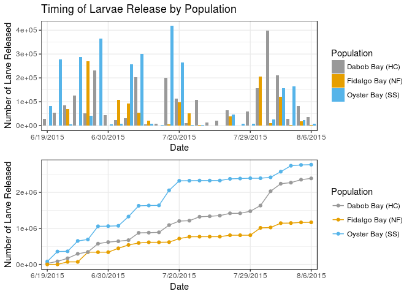
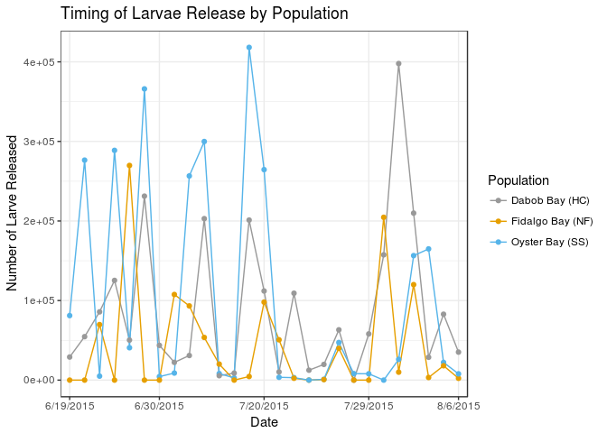

Puget Sound Reproduction 2015
================
Katherine Silliman

-   [Read in data](#read-in-data)
-   [Make Graphs](#make-graphs)
-   [Total larvae through time](#total-larvae-through-time)

``` r
library(ggplot2) #for plotting
library(dplyr) #Data summary
library(plotrix)#for SE calculation
library("grid") #for plotting
```

Read in data
============

``` r
larvae = read.csv("Larval counts - Day 1.csv", header = TRUE)
pop_Total_Date <- subset(larvae, select = c(Population,Date,Total.by.date)) %>% group_by(Population) %>% arrange(Date)
pop_Total_Date_na <- na.omit(pop_Total_Date) 

#Calculate cumulative larvae released through time
pop_Total_Date_na <- mutate(pop_Total_Date_na,cum=cumsum(Total.by.date))
```

Make Graphs
===========

Stacked graphs of cumulative larvae through time and number of larvae released by date

``` r
b <- ggplot(data=pop_Total_Date_na, aes(x=Date, y=Total.by.date, group=Population, fill=Population)) + 
  geom_bar(stat="identity",position=position_dodge()) + ylab("Number of Larve Released")+ 
  ggtitle("Timing of Larvae Release by Population") + scale_x_discrete(breaks= c("6/19/2015","6/30/2015", "7/20/2015","7/29/2015","8/6/2015"))+
  scale_fill_manual(values=c("#999999", "#E69F00", "#56B4E9"))+theme_bw() 

l <- ggplot(data=pop_Total_Date_na, aes(x=Date, y=cum, group=Population, colour=Population)) +
  geom_line() + geom_point() + ylab("Number of Larve Released") +
  scale_x_discrete(breaks= c("6/19/2015","6/30/2015","7/20/2015","7/29/2015","8/6/2015"))+
  scale_color_manual(values=c("#999999", "#E69F00", "#56B4E9"))+theme_bw() 
grid.newpage()
grid.draw(rbind(ggplotGrob(b),ggplotGrob(l),size="last"))
```



Make graph with cumulative larvae overlaying bar graph

``` r
b <- b + geom_line(data=pop_Total_Date_na, aes(x=Date, y=cum/4, group=Population, colour=Population)) +
  scale_color_manual(values=c("#999999", "#E69F00", "#56B4E9"))+theme_bw() +
  scale_y_continuous(sec.axis = sec_axis(~.*4,name="Cumulative Larvae Released"))
b
```


Plotting line graphs of reproductive timing.

``` r
ggplot(data=pop_Total_Date_na, aes(x=Date, y=Total.by.date, group=Population, colour=Population)) + 
  geom_line() + geom_point() + ylab("Number of Larve Released")+ 
  ggtitle("Timing of Larvae Release by Population") + scale_x_discrete(breaks= c("6/19/2015","6/30/2015", "7/20/2015","7/29/2015","8/6/2015"))+
  scale_color_manual(values=c("#999999", "#E69F00", "#56B4E9"))+theme_bw() 
```



Total larvae through time
=========================

``` r
x <- group_by(pop_Total_Date_na, Population) 
summarize(x , overall_Total = sum(Total.by.date), max.larvae = max(Total.by.date), mean.larvae = mean(Total.by.date), se.larvae = std.error(Total.by.date))
```

    ## # A tibble: 3 x 5
    ##         Population overall_Total max.larvae mean.larvae se.larvae
    ##             <fctr>         <dbl>      <dbl>       <dbl>     <dbl>
    ## 1   Dabob Bay (HC)       2388376   397866.7    88458.37  17913.63
    ## 2 Fidalgo Bay (NF)       1168418   269775.0    43274.73  13136.30
    ## 3  Oyster Bay (SS)       2770052   418200.0   102594.50  25984.68
